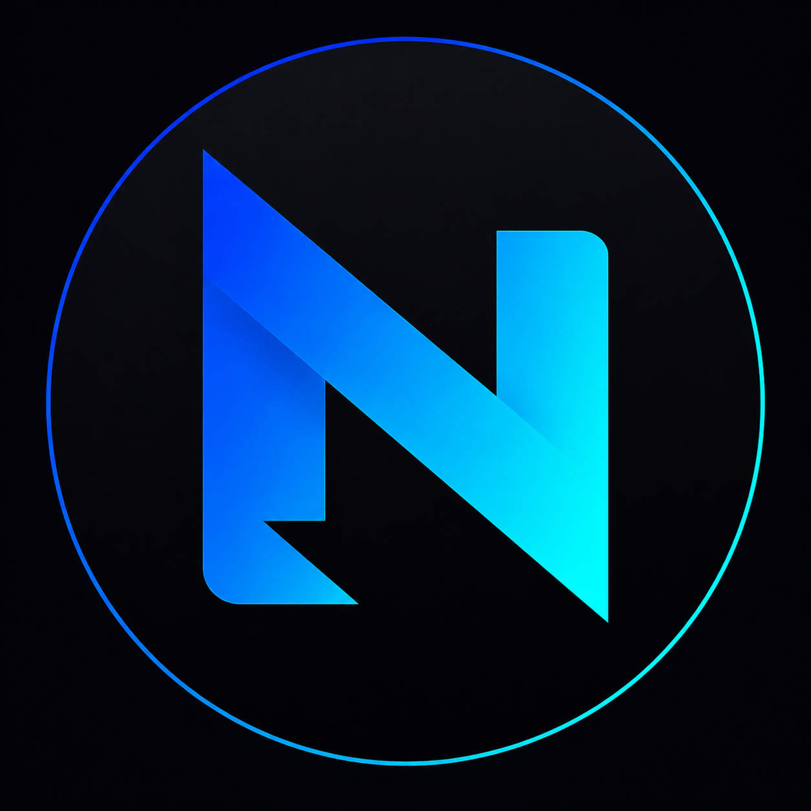
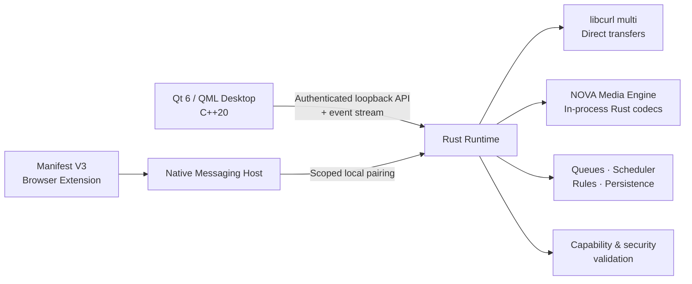

<div align="center">



# NOVA Download Manager

### Native desktop control. Rust-powered transfers. Browser handoff.

A modern, open-source download manager built around a **Qt 6 / QML / C++20 desktop UI**, a **Rust download runtime**, **libcurl multi**, NOVA's in-process media and codec cores, and a **Manifest V3 browser companion**.

[](https://github.com/Alaa91H/NOVADownloadManager/actions/workflows/nova-ci.yml)
[](https://github.com/Alaa91H/NOVADownloadManager/releases/latest)
[](LICENSE)
[](https://github.com/Alaa91H/NOVADownloadManager/stargazers)
[](https://ko-fi.com/alaa91h)
[](#platforms)
[](#platforms)
[](#platforms)

**[Download](https://github.com/Alaa91H/NOVADownloadManager/releases/latest)** ·
**[Documentation](docs/README.md)** ·
**[Discussions](https://github.com/Alaa91H/NOVADownloadManager/discussions)** ·
**[Report a bug](https://github.com/Alaa91H/NOVADownloadManager/issues/new/choose)** ·
**[Contribute](CONTRIBUTING.md)** ·
**[Security](SECURITY.md)**

</div>

---

> [!IMPORTANT]
> **NOVA is under active alpha development.** The Qt/QML desktop interface is the primary mainline UI. Production release tagging is intentionally protected by stricter validation gates, so features and packaging may continue to evolve between alpha builds.

## ✨ Why NOVA?

NOVA is designed as a **native desktop download manager with a separate, capability-aware runtime** rather than a thin browser wrapper. The desktop UI focuses on control and visibility; the Rust runtime owns transfer execution, persistence, queue policy, media processing, capability validation, and browser handoff.

| | Capability | What it gives you |
|---|---|---|
| ⚡ | **Native transfer engine** | Direct downloads through linked `libcurl multi`, with runtime capability detection. |
| 🧩 | **Multi-connection downloads** | Segmented byte-range transfers when the remote server supports Range requests. |
| ⏯️ | **Pause & resume** | Checkpoint-aware resume paths that preserve owned partial download data when the server allows it. |
| 🎬 | **Native media workflows** | NOVA-owned extraction, playlist, HLS/DASH, mux, subtitle, and local conversion paths, with codec/container choices reported from the linked Rust registries. |
| 🌐 | **Browser integration** | Manifest V3 companion for Chromium-family browsers and Firefox, paired with NOVA locally. |
| 🗂️ | **Serious task management** | Queues, priorities, retries, categories, mirrors, checksums, bandwidth controls, rules, and schedules. |
| 🔎 | **Focused desktop UX** | Search, filtering, sorting, configurable columns, task inspector, live metrics, and speed history. |
| 🧰 | **Power tools** | Batch import, Media Downloader, Link Grabber, diagnostics, runtime logs, and engine controls. |
| ♿ | **Accessibility-first gates** | Keyboard navigation, focus semantics, contrast validation, text scaling, High-DPI checks, and reduced-motion support. |
| 🌍 | **English + Arabic** | Maintained release dictionaries with full application-wide RTL behavior for Arabic. |
| 🔐 | **Local integration model** | Loopback-only service discovery, scoped credentials, authenticated pairing, and daemon-side validation. |

## 🖥️ Desktop experience

NOVA's current desktop shell is built with **Qt 6 / QML** and includes:

- a frameless native window with compact title bar and global download search;
- collapsible navigation with hidden, icons-only, and expanded modes;
- a compact command bar with secondary actions grouped under overflow;
- configurable download columns, sorting, filtering, and persistent layout state;
- an optional task inspector with live transfer information and speed history;
- queue manager, scheduler, batch import, Media Downloader, and Link Grabber;
- system tray integration, notifications, native file/folder dialogs, and platform progress;
- diagnostics, runtime logs, engine controls, browser-integration repair, and update checks;
- configurable density, accent, corner radius, and panel visibility;
- System / Light / Dark themes, High Contrast, Reduced Motion, and text scaling.

## 🧠 Architecture



The UI is intentionally a **presentation and desktop-integration layer**. Download execution and final capability checks remain runtime-owned.

## 🚀 Download & install

Use the **GitHub Releases** page for published builds:

### [⬇️ Download the latest NOVA release](https://github.com/Alaa91H/NOVADownloadManager/releases/latest)

Release artifacts can include desktop installers/packages, browser-extension bundles, Android ARM64 builds, and `SHA256SUMS.txt` depending on the release tag and CI matrix.

> [!TIP]
> Verify downloaded artifacts against the accompanying `SHA256SUMS.txt` before installation whenever it is provided.

## 💻 Platforms

NOVA's native desktop CI validates six OS/architecture targets:

| Platform | Architectures | Native desktop CI |
|---|---|---:|
| **Windows** | x64, ARM64 | ✅ |
| **Linux** | x64, ARM64 | ✅ |
| **macOS** | Intel, Apple Silicon | ✅ |

Actual installable artifacts may vary by release while the project remains in alpha.

Android is maintained as a separate product surface under `android/`, with shared Rust components under `crates/`.

## 🌐 Browser companion

The browser extension hands supported download candidates to the local NOVA service through a constrained local integration path.

The integration model includes:

- loopback-only daemon discovery;
- scoped bearer credentials;
- Native Messaging host `com.nova.downloadmanager`;
- proof-based automatic pairing;
- pinned Chromium extension identity derived from the manifest key;
- pinned Firefox extension identity;
- capability checks before unsupported options reach the runtime.

NOVA does **not** bypass DRM, access controls, account requirements, CAPTCHAs, regional restrictions, or browser/site policy.

See **[browser-extension documentation](docs/extension/README.md)** for packaging and capture details.

## 🔐 Security model

NOVA applies security checks at the runtime boundary rather than trusting UI state alone.

Key protections include:

- loopback-bound local services;
- scoped authentication;
- protocol and capability validation before task execution;
- checks for SSRF-sensitive outbound destinations;
- controlled local file operations;
- redaction of configured credential fields;
- identity consistency checks across the browser extension, Qt frontend, and Rust Native Messaging host.

Security issues should be reported according to **[SECURITY.md](SECURITY.md)**.

## 🧱 Repository layout

```text
.
├── desktop-native/       # Qt 6 / QML / C++20 desktop application
├── src-tauri/            # Rust runtime + native backend/host binaries
├── browser-extension/    # Manifest V3 companion extension
├── android/              # Android product surface
├── crates/               # Shared Rust cores and bridges
├── branding/source/      # Canonical NOVA artwork
├── scripts/              # Build, release, security and verification tooling
├── docs/                 # Architecture, quality and release documentation
└── .github/              # CI, issue templates and dependency policy
```

Node/pnpm at the repository root is used for repository tooling and browser-extension workflows; the primary desktop interface is Qt/QML.

## 🛠️ Build from source

### Requirements

For native desktop development:

- **Qt 6.8+** with Quick, Quick Controls 2, Network, and Widgets;
- **CMake 3.24+**;
- a **C++20** compiler;
- **Rust stable**;
- native **libcurl/OpenSSL** development libraries for your platform.

For browser-extension tooling:

- **Node.js 24+**
- **pnpm 11**

### 1. Clone

```bash
git clone https://github.com/Alaa91H/NOVADownloadManager.git
cd NOVADownloadManager
```

### 2. Build the Rust runtime

```bash
cargo build --manifest-path src-tauri/Cargo.toml --release \
  --bin nova-native-backend \
  --bin nova-native-host
```

### 3. Configure and build the native desktop app

```bash
cmake -S desktop-native -B build/native \
  -DCMAKE_BUILD_TYPE=Release \
  -DNOVA_BUILD_TESTS=ON

cmake --build build/native --config Release --parallel
ctest --test-dir build/native -C Release --output-on-failure
```

Or use the repository scripts:

```bash
pnpm run runtime:check
pnpm run runtime:test
pnpm run native:configure
pnpm run native:build
pnpm run native:test
pnpm run native:check
```

### Browser extension

```bash
pnpm install --frozen-lockfile
pnpm --filter nova-browser-extension typecheck
pnpm --filter nova-browser-extension test:unit
pnpm --filter nova-browser-extension verify:offline
pnpm run extension:package
```

## ✅ Quality gates

NOVA's repository includes automated checks covering more than compilation alone:

- Qt/C++ and Rust build/test validation;
- English/Arabic localization completeness;
- hard-coded user-visible text checks;
- approved desktop-shell contract checks;
- keyboard and accessibility semantics;
- WCAG-oriented text/focus contrast checks;
- Qt High-DPI validation at 125% and 200%;
- large-list and recovery behavior;
- packaged Native Messaging framing;
- browser/Qt/Rust identity consistency;
- branding consistency;
- repository security checks;
- project-fact verification.

Run the repository-level checks with:

```bash
pnpm run native:check
pnpm run security:check
pnpm run branding:verify
pnpm run facts:verify
```

## 🧪 Production-readiness gate

The native Qt/QML interface is already the **primary desktop implementation**, but production tagging is intentionally stricter than mainline adoption.

The strict gate is:

```bash
node desktop-native/scripts/check-parity.mjs --require-complete
```

It remains blocking until the required external validation work is complete, including packaged real-browser E2E, signed updater installation, exact six-platform release-candidate validation, and final assistive-technology / mixed-DPI testing.

See **[Native UI replacement record](docs/NATIVE_UI_MIGRATION.md)** for the current status.

## 🤝 Contributing

Contributions, bug reports, testing feedback, and documentation improvements are welcome.

Please read **[CONTRIBUTING.md](CONTRIBUTING.md)** before opening a pull request, and use the repository's issue templates when reporting problems.

Looking for a place to start? Browse **[help wanted](https://github.com/Alaa91H/NOVADownloadManager/issues?q=is%3Aissue+is%3Aopen+label%3A%22help+wanted%22)**, **[good first issue](https://github.com/Alaa91H/NOVADownloadManager/issues?q=is%3Aissue+is%3Aopen+label%3A%22good+first+issue%22)**, or join the **[Discussions](https://github.com/Alaa91H/NOVADownloadManager/discussions)**.

When reporting a download issue, include:

- NOVA version;
- operating system and architecture;
- task status or exact error text;
- a redacted diagnostic log when relevant.

Never publish credentials, access tokens, signed/private URLs, or sensitive local paths in a public issue.

## ⭐ Support NOVA

If NOVA is useful to you:

- **Star the repository** to help other developers discover it.
- **Report reproducible issues** so reliability can improve.
- **Share feedback** about real-world browser and download workflows.
- **Contribute code, tests, translations, or documentation.**
- Support ongoing development through **[Ko-fi](https://ko-fi.com/alaa91h)**.

## 📚 Documentation

Useful starting points:

- [Documentation index](docs/README.md)
- [Community launch kit](docs/COMMUNITY_LAUNCH_KIT.md)
- [Native UI replacement record](docs/NATIVE_UI_MIGRATION.md)
- [Browser extension](docs/extension/README.md)
- [Security policy](SECURITY.md)
- [Contributing guide](CONTRIBUTING.md)
- [Changelog](CHANGELOG.md)
- [Third-party notices](THIRD_PARTY_NOTICES.md)

## 📄 License

NOVA Download Manager is released under the **[MIT License](LICENSE)**.

Bundled third-party components — including curl/libcurl and the vendored Rust media codec backend — remain subject to their respective licenses. See **[THIRD_PARTY_NOTICES.md](THIRD_PARTY_NOTICES.md)**.

---

<div align="center">

### Built to make serious download management feel native again.

**[GitHub](https://github.com/Alaa91H)** ·
**[Telegram](https://t.me/Alaa91h)** ·
**[Email](mailto:alahus2591@gmail.com)** ·
**[Ko-fi](https://ko-fi.com/alaa91h)**

<sub>NOVA Download Manager · Open source · MIT licensed</sub>

</div>
