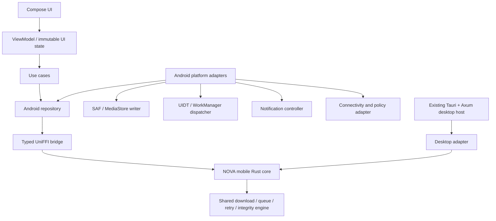

# NOVA Android Architecture Audit

**Status:** Architecture audit updated after the Android foundation milestone. A native Compose app, portable task-model extraction, a narrow UniFFI handshake, an ARM64 link proof, and a debug-APK/JVM-test build now exist. No real transfer, runtime native loading, emulator, or physical-device validation has occurred.

**Scope:** This report audits the repository as it existed at `v2.4.25-alpha` / commit `954644e`. It is the source-of-truth baseline for an Android implementation that reuses NOVA’s Rust download semantics without creating a second engine.

## Executive decision

The desktop Rust package `src-tauri` remains **not suitable for direct Android embedding**. It still combines portable download logic with the Tauri shell, an Axum loopback daemon, desktop resource discovery, process control, native-host integration, and desktop credential-store assumptions. Its crate types alone do not make it an Android boundary.

The implemented first step is an **incremental extraction**, not a port of the desktop daemon and not a Kotlin reimplementation: `nova-core-model` now owns the shared `Task` and `Segment` records, and `nova-mobile-ffi` exposes a deliberately narrow, versioned UniFFI handshake that links for Android ARM64. A future `nova-mobile-core` must own shared task state, queue/retry policy, direct-download planning, integrity validation, and persistence contracts. Tauri, Axum, browser native messaging, desktop binary discovery, tray/window behavior, and desktop subprocess media execution remain outside that boundary.

> **Important:** “Rust core reuse percentage” remains intentionally unclaimed. The task-model crate and narrow FFI handshake are compiled evidence of an initial boundary, not evidence that NOVA's transfer engine, queue policy, retry state, persistence, or media capability has been reused on Android. Future milestones must measure reuse through module ownership and test coverage.

## Repository evidence

| Area | Repository implementation | Android disposition | Evidence |
|---|---|---|---|
| Task model and snapshots | `src-tauri/src/daemon/types.rs`; task snapshots in `state.rs` | **Shared after extraction** | Serializable task, segment, direct-request, media-job, and curl-job models already exist. |
| Direct HTTP(S) downloads | `daemon/curl/*`, `daemon/direct.rs`, `engine/dynamic_segments.rs` | **Shared after extraction** | libcurl, range/segment planning, file-part naming, integrity metadata, connection limits, and retry-related pieces are Rust. |
| Queue, priority, bandwidth, profiles | `engine/priority_queue.rs`, `bandwidth.rs`, `profiles.rs` | **Shared after extraction** | These are Rust state/policy components, although currently assembled in desktop `AppState`. |
| Retry, rules, scheduler, policy | `engine/retry.rs`, `rules.rs`, `scheduler.rs`, `policy_engine.rs` | **Shared after extraction** | Semantics can remain in Rust; Android decides when an OS job/service may execute. |
| Persistence | `daemon/persist.rs` | **Adapt** | Current persistence accepts a desktop `data_dir` and serializes desktop state. Preserve the model while replacing desktop-path ownership with an Android storage adapter. |
| Metadata and checksums | `engine/metadata_cache.rs`, `checksum.rs`, routes | **Shared after extraction** | Algorithmic logic should move with the core, with Android invoking it through typed commands. |
| Eventing | `engine/event_bus.rs`, SSE routes | **Adapt** | The event bus can be shared; Axum/SSE is desktop transport only. Kotlin receives a throttled bridge subscription/flow instead of local HTTP SSE. |
| Desktop API / local daemon | `daemon/mod.rs`, `routes/*`, `static_files.rs` | **Desktop-only transport** | Axum loopback server, CORS/browser-origin logic, bearer-token middleware, SPA assets, port-file discovery, and SSE endpoints are not Android application architecture. |
| Tauri shell | `src-tauri/src/lib.rs`, Tauri plugins | **Desktop-only** | Window, tray, updater, shell, single-instance, desktop dialog, and clipboard plugin setup belong to the desktop host. |
| Browser extension | `browser-extension/*`, `native_host/*` | **Replace with Android share/intent adapter** | Native Messaging and loopback pairing do not map to Android; `ACTION_SEND`/deep links are the Android input surface. |
| External tools / media | `external_tools/*`, `ytdlp.rs`, subprocess invocations | **Separate Android media adapter** | Desktop executable paths, `PATH` discovery, package installers, and subprocess assumptions cannot be reused as-is on Android. |
| Telegram automation | `telegram.rs` | **Defer / evaluate separately** | It is daemon-oriented and network-lifecycle dependent; do not start it inside the initial Android download service. |
| Credential store | `keyring` in `src-tauri/src/lib.rs` | **Android adapter** | Android must use platform-backed secure storage; no desktop keyring behavior may leak into mobile. |

## Existing composition problem

The current `AppState` is a desktop daemon composition root. It owns live curl/media job maps, an Axum HTTP client, filesystem data/resource directories, ffmpeg/yt-dlp executable paths, a bearer token for the loopback API, external-tool installation, watchdog threads, scheduler state, and download policy. `start_daemon()` also binds `127.0.0.1`, writes a port file, restores state, starts persistence and automation, registers Axum routes, and handles process signals.

That structure is appropriate for the desktop app but must **not** be passed through JNI or UniFFI. Android must instead compose an Android host around an extracted core session. The Kotlin layer must never create or manipulate `AppState`, `Router`, Tauri types, or private engine internals.

## Target architecture



### Required Rust boundaries

| Proposed crate | Owns | Must not own |
|---|---|---|
| `crates/nova-core-model` | Public task IDs, statuses, task DTOs, queue/retry/profile/scheduler contracts, domain errors | Tauri, Axum, Android/JNI types, filesystem paths, secrets |
| `crates/nova-download-core` | libcurl transfer orchestration, segment planning, progress aggregation, checksum verification, retry state | Tauri route handlers, desktop subprocesses, local HTTP server |
| `crates/nova-mobile-core` | Mobile session facade, durable task intents, capability-safe callbacks, event throttling | Compose/UI types, Android `Context`, direct SAF calls |
| `crates/nova-mobile-ffi` | UniFFI-exported records/enums/errors/objects and bridge-version check | Domain policy duplication, unbounded event payloads |
| `src-tauri` | Existing desktop Tauri shell, Axum routes, browser extension/native host, desktop resources and media tools | Android lifecycle, Kotlin UI, Android storage |
| `android/app` | Compose UI, services/jobs, intents, notification actions, Android storage, network awareness | Download algorithm, segmented-transfer policy, retry state machine |

The names above are a proposed module layout, not code that already exists.

## Android execution architecture

The adapter must select an Android execution primitive per request rather than treating every download as a permanent foreground service.

| Download class | Android 14+ strategy | Earlier Android fallback | Core responsibility | Android responsibility |
|---|---|---|---|---|
| User taps Download and expects immediate visible progress | User-Initiated Data Transfer (UIDT) `JobService` | Long-running `WorkManager`/foreground implementation | Run task, emit bounded progress, persist checkpoints | Schedule job while visible, update notification, stop/reschedule safely |
| Scheduled, deferred, Wi-Fi-only retry | WorkManager with network/storage/battery constraints | WorkManager | Decide eligible queued task and preserve retry state | Translate preferences to constraints; tolerate cancellation/retry |
| Short persistence, finalization, small housekeeping | WorkManager or short bounded operation | WorkManager | Commit task state/checksum outcome | Schedule safely without abusing FGS |
| Media post-processing on supported releases | `mediaProcessing` FGS only where truly applicable | Explicit user-visible, bounded fallback | Core media intent/result model | Platform codec/backend policy and notification |

This follows Android’s guidance that user-started, progress-visible transfers use UIDT on Android 14+, while deferrable work belongs to WorkManager. Android may terminate a process without a callback; the core therefore must checkpoint durable task state before and during work.[1] [2] WorkManager’s long-running mode itself uses a foreground service and remains subject to job/foreground restrictions.[3]

## Storage architecture

Android destinations are **capabilities**, not desktop paths. The core should receive an opaque destination descriptor and interact through a constrained writer interface; it must not infer unrestricted filesystem paths.

| Destination | Android adapter | Core contract | Recovery behavior |
|---|---|---|---|
| App-specific staging | App-private file via NDK-compatible path/file descriptor | Atomic staging and checkpoint writes | Reopen from durable local state |
| User-selected folder | SAF `ACTION_OPEN_DOCUMENT_TREE` plus persisted URI grant | Create/open document through a writer handle | Detect revoked grant and return recoverable `DestinationPermissionRevoked` |
| Standard downloads/media | MediaStore insertion with content URI | Write to adapter-provided descriptor/stream | Finalize pending media only after transfer succeeds |
| External/removable provider | SAF provider URI | Same interface, never assume stable POSIX path | Handle provider/offline/storage errors without data loss |

SAF supports persistent access to a user-selected document tree and provider-backed storage.[4] On Android 10+, files NOVA owns in `MediaStore.Downloads` do not require broad storage permissions; access to another app’s downloads requires SAF.[5]

## Bridge contract

The first FFI surface must be typed, versioned, and small. It should expose records/enums/error types rather than JSON strings, `AppState`, or generic route invocations.

```text
initialize(config, bridgeVersion) -> CoreInfo | BridgeCompatibilityError
createTask(CreateTaskRequest) -> TaskSnapshot
startTask(taskId) -> CommandResult
pauseTask(taskId) -> CommandResult
resumeTask(taskId) -> CommandResult
cancelTask(taskId) -> CommandResult
retryTask(taskId) -> CommandResult
listTasks(TaskQuery) -> TaskPage
getSettings() -> CoreSettings
updateSettings(SettingsPatch) -> CoreSettings
getDiagnostics() -> RedactedDiagnostics
observeEvents(sinceEventId) -> bounded event subscription
```

Each request/result must have an explicit schema version. Progress emission must be aggregated and throttled; a 1,000-item history must never cause full-state marshaling for every byte update. UniFFI is a suitable candidate because it exposes typed Rust objects, records, errors, and asynchronous APIs to Kotlin bindings.[6] The final choice still needs a proof-of-build against the Android NDK before adoption.

## Feature parity matrix

| Desktop capability | Current implementation evidence | Android strategy | Initial status |
|---|---|---|---|
| HTTP/HTTPS direct downloads | libcurl, direct routes, curl engine | Shared Rust transfer core | Requires extraction |
| Segments / ranges / connection limits | `direct.rs`, dynamic/adaptive modules | Shared Rust core | Requires Android ABI proof |
| Pause/resume/retry | task state, curl jobs, retry engine | Shared core + Android dispatcher | Requires extraction |
| Queue/priority/bandwidth/profiles | engine queue/bandwidth/profiles | Shared core policy | Requires extraction |
| Checksum/integrity | checksum engine | Shared core | Requires extraction |
| Durable recovery | `persist.rs` / restore flow | Shared serialized state + Android store/adapter | Requires storage redesign |
| Scheduler/rules | scheduler/rules engines | Shared semantics + WorkManager/UIDT policy adapter | Requires adapter |
| Desktop notifications / tray | Tauri shell/tray | Android notification channels/actions | Android-only implementation |
| Browser extension capture | Browser extension + native host + local daemon | Share intent / text URL extraction / verified deep link | Android-specific replacement |
| Native host pairing | Desktop native host | Not applicable | Desktop-only |
| yt-dlp/FFmpeg executables | External tools + subprocesses | Separate, capability-gated Android media backend | Deferred; no parity claim |
| Telegram bot | daemon automation | Defer until background/policy review | Deferred |
| Desktop updater/window/shell | Tauri plugins | Play / Android update distribution, Activities | Desktop-only behavior |
| Diagnostics/log export | daemon diagnostics/logging | Redacted Android diagnostics and share sheet | Requires adapter |

## Security review baseline

The desktop daemon already protects its loopback API with a generated bearer token, origin constraints, and redacted log paths. These protections cannot be copied mechanically to Android. Android should have no open loopback control plane in the first release. Bridge calls are in-process and typed; incoming `ACTION_SEND`, `content://`, and deep-link data must be validated at the Kotlin boundary before it reaches the core.

Sensitive headers, cookies, tokens, and credentials must never be serialized in generic diagnostics or error logs. Android secure storage and SAF grant handling belong to the platform adapter. Filenames, MIME types, remote metadata, and archive names remain untrusted inputs; the existing filename/path traversal validation should be moved or covered by portable tests before Android writes are enabled.

## Build-environment audit

| Tooling item | Observed status | Consequence |
|---|---|---|
| Java | JDK 17 installed and selected for Android build | Provides the `javac` toolchain required by AGP 9.3 |
| Gradle | Wrapper 9.5.0 generated with distribution SHA-256 pin | Use `android/gradlew`; do not depend on a system Gradle |
| Android SDK / `sdkmanager` | Platform `android-37.0` and Build Tools 36.0.0 provisioned | Debug APK and JVM-test build passed; instrumentation/device tests remain unrun |
| Android NDK | 28.2.13676358 provisioned | ARM64 `nova-mobile-ffi` `cdylib` link proof passed |
| Rust Android targets | `aarch64-linux-android` installed | Native ARM64 proof exists; other ABI builds remain pending |
| Existing Android project | Compose/Material 3 foundation under `android/` | Native UI shell, share parsing, repository boundary, and inert service scaffolding exist; no transfer runtime yet |

## Ordered implementation gates

1. **Gate A — Compile boundary:** **Partially complete.** `Task` and `Segment` moved to `nova-core-model`; portable tests and desktop re-export validation exist. Transfer core remains coupled to desktop composition.
2. **Gate B — Bridge proof:** **Partially complete.** UniFFI API versioning and an `arm64-v8a` link proof exist locally; generated Kotlin bindings and CI ABI artifacts do not.
3. **Gate C — Android foundation:** **Complete for the foundation only.** Compose/Material 3, adaptive navigation, StateFlow ViewModel, repository boundary, share validation, and a buildable debug APK exist without a duplicated engine.
4. **Gate D — Real transfer:** implement one direct HTTP(S) download to app-private staging, with pause/resume/cancel and durable recovery.
5. **Gate E — Android execution:** dispatch user-started transfers through UIDT on API 34+ and a validated fallback below it; add notification actions.
6. **Gate F — Storage:** SAF and MediaStore destinations with permission-revocation recovery and no legacy broad storage model.
7. **Gate G — Capability parity:** progressively add queue, profiles, schedules, diagnostics, share intent, and only then evaluate media integrations.
8. **Gate H — Release readiness:** physical-device testing, API/ABI matrix, security review, crash/symbol policy, and Play policy review.

## Known constraints and non-goals for the first Android milestone

- The desktop Axum daemon is not an Android service design and will not be embedded unchanged.
- The Android foundation builds a debug APK and its current JVM tests pass; an ARM64 `cdylib` link proof also passes. No emulator or physical Android device has been used, and no actual download, runtime native load, background operation, storage operation, or notification action has been tested.
- yt-dlp and FFmpeg must not be treated as desktop executable paths on Android. Their legal, packaging, binary-size, execution, and policy constraints require a dedicated subsequent design.
- Feature parity is a roadmap metric, not a current claim. The first releasable Android slice should support only capabilities that have a typed bridge, durable recovery, Android-compliant execution, and real-device validation.

## References

[1] [Android Developers — Data transfer background task options](https://developer.android.com/develop/background-work/background-tasks/data-transfer-options)

[2] [Android Developers — User-initiated data transfer](https://developer.android.com/develop/background-work/background-tasks/uidt)

[3] [Android Developers — Support for long-running workers](https://developer.android.com/develop/background-work/background-tasks/persistent/how-to/long-running)

[4] [Android Developers — Storage Access Framework](https://developer.android.com/guide/topics/providers/document-provider)

[5] [Android Developers — Access media files from shared storage](https://developer.android.com/training/data-storage/shared/media)

[6] [UniFFI User Guide — Interfaces](https://mozilla.github.io/uniffi-rs/latest/udl/interfaces.html)
