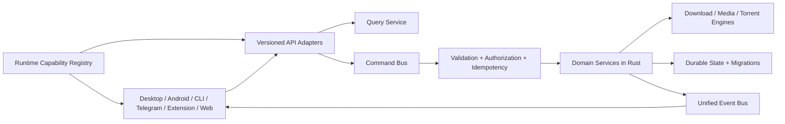

# معمارية NOVA Unified Control Plane

**الحالة:** مواصفة تنفيذ مرحلية. لا تعني هذه الوثيقة أن كل المسارات المذكورة منفذة أو متحققة.

**الهدف:** جعل Runtime Rust مالكًا وحيدًا للعقود والسياسات والحالة والإمكانيات، وتحويل Desktop وAndroid وCLI وTelegram وBrowser Extension وأي Web UI إلى عملاء يرسلون أوامر ويستعلمون عبر العقود نفسها.

## مبادئ ملزمة

1. **Core First:** كل قدرة أعمال جديدة تبدأ في Rust Core والعقد المشترك، ثم تضاف محولات العملاء. لا تنفذ واجهةٌ سياسةً بديلة أو تتصل بوظائف daemon الداخلية.
2. **Runtime is the source of truth:** يسجل Runtime ما بُني فعلًا وما يستطيع تنفيذه في هذه النسخة والمنصة. لا تعرض الواجهات خيارًا اعتمادًا على إعداد ثابت أو اسم محرك فقط.
3. **Parity is per capability:** نجاح Android أو Desktop عمومًا لا يثبت تكافؤًا. لكل قدرة مستقرة عقد، API، أحداث عند انطباقها، تمثيل للمحولات المطلوبة، واختبار يثبتها. تسجّل الاستثناءات المنصية والبديل صراحة.
4. **Native means in-process:** لا تعتمد وظيفة Media أساسية على `yt-dlp` أو `FFmpeg` كبرنامج خارجي. لا fallback صامتًا. تسجل Runtime codecs والحاويات المتاحة فعلًا، وترفض الطلب غير المدعوم بسبب واضح.
5. **Versioned contracts:** نماذج الأوامر والاستعلامات والأحداث والإعدادات ذات إصدار وترحيل وتوافق خلفي محدد. تبقى المسارات القائمة متاحة أثناء ترحيل العملاء إلى `/api/v1`.
6. **Security boundaries:** Local Loopback API وRemote API حدّان أمنيان منفصلان. لا يُفتح التحكم البعيد قبل TLS والمصادقة والصلاحيات والتدقيق والحد من المعدل.

## الوضع الحالي الذي يجب البناء عليه

تحتوي الشجرة بالفعل على `nova-core-model`، وحافلة أحداث Rust في `src-tauri/src/daemon/engine/event_bus.rs`، واستجابة Runtime capabilities في `src-tauri/src/daemon/engine_capabilities.rs`، ومحركات media وtorrent أصلية. يضم سجل الوسائط الحالي codec lists مشتقة من سجلات محرك المعالجة ويعرض مفاتيح الخيارات المدعومة وغير المدعومة. توجد أيضًا مسارات API v1 في بعض مكونات المشروع، وطرق Telegram ضمن daemon.

هذه نقاط أساس مصدرية فقط. لا تثبت وحدها وجود Command Bus موحد، أو تماثلًا بين كل العملاء، أو تحملًا بعد إعادة التشغيل، أو قبولًا على جهاز Android. تُبقى ادعاءات الإنجاز منفصلة عن دليل CI والجهاز. تحديث هذه الحالة يتطلب مراجعة المصدر ونتيجة تحقق على SHA محدد.

## الحدود والتدفق

يستقبل Command Bus envelope موحدًا يتضمن `contractVersion`, `requestId`, `idempotencyKey`, `principal`, `scopes` وبيانات الأمر. ينجز التحقق من النوع والقيم والصلاحية مرة واحدة، ثم يوجه إلى خدمة المجال. تنفذ Queries القراءة دون تعديل الحالة. تستعمل المحولات استجابات أخطاء منظمة مع `code`, `message`, `details`, `retryable` و`requestId`.

## سجل الإمكانيات والعقود

لكل عنصر capability هوية مستقرة وإصدار وحالة ومصدر وقيود وإثبات. الحالات الأساسية:

| الحالة | المعنى |
|---|---|
| `supported` | تنفيذ متاح في هذا البناء، وتستطيع الخدمة قبوله الآن. |
| `unavailable` | التنفيذ غير موجود أو غير مهيأ؛ يقدم السبب ولا يظهر كخيار قابل للتشغيل. |
| `experimental` | التنفيذ متاح خلف وصف وتحذير واضحين، ولا يدخل بوابة parity المستقرة. |
| `platformRestricted` | التنفيذ مقيد بمنصة أو إصدار نظام؛ يسجل البديل المنصي. |

يعرض `CapabilityEntry` على الأقل: `id`, `version`, `status`, `platforms`, `clientAdapters`, `operations`, `events`, `constraints`, `reason`, `evidence`. القيم مشتقة من سجلات المحرك والبناء واختبارات العقود، وليست نسخًا مستقلة في QML أو Kotlin أو Telegram. يضم سجل الوسائط الحاويات وواجهات demux/mux وvideo/audio decoders وencoders وsubtitle formats وقيود HDR والألوان والصيغ والعتاد عندما يستطيع المحرك إثباتها. المجهول يعلن `unavailable` مع سبب؛ لا يستنتج من امتداد الملف.

ينشأ تعريف واحد versioned لموديلات `Task`, `Queue`, `Profile`, `Rule`, `Schedule`, `NetworkProfile`, `Torrent`, `MediaJob`, `Destination` والحالات. تستهلكه Rust وAPI وتولد منه/تتحقق به روابط العملاء. يمنع فحص CI تغيّر عقد غير متوافق بلا زيادة إصدار وترحيل موثق.

## الأوامر والاستعلامات والأحداث

الأوامر الأساسية تشمل `add`, `pause`, `resume`, `delete`, `retry`, `schedule`, `move`, `setPriority`, `setProfile`, وإجراءات torrent/media. تدعم batch على مستوى Core، وإعادة المحاولة الآمنة عبر idempotency keys. تستعلم الواجهات عن القوائم والتفاصيل والقدرات والحالة والـdiagnostics من Query APIs مصفحة وقابلة للترشيح.

توحد الأحداث أسماء مثل `download.created`, `download.started`, `download.retrying`, `download.completed`, `torrent.completed`, `queue.empty`, `scheduler.triggered`, `network.changed`. تحمل event ID وترتيبًا وهوية المهمة والطابع الزمني وإصدار schema. يستعمل Desktop وAndroid وCLI وTelegram وWebhooks المحول نفسه، مع استمرار دعم SSE أو آلية البث الحالية أثناء ترحيل المستهلكين.

تُحفظ دورة المهمة كاملة: `queued`, `preparing`, `probing`, `downloading`, `pausing`, `paused`, `retrying`, `recovering`, `verifying`, `finalizing`, `completed`, `error`, `interrupted`. لا تختزلها الواجهات إلى حالات عامة. تستعيد الكتابات الذرية والمخططات المرقمة المهام والطوابير والجداول والقواعد والملفات الجزئية بعد انهيار العملية أو إعادة التشغيل.

## قدرات المجال

| المجال | العقد والسلوك المطلوب |
|---|---|
| التنزيل والمحرك | تنزيل مباشر ومجزأ، adaptive connections وdynamic segmentation، حدود اتصالات ومخازن، range/reuse/binding، سبب تغيّر الاتصالات، retry مع backoff وjitter ومعالجة 429/503، mirrors/failover، checksum، والتحقق والاستعادة. الخيارات المتقدمة خلف Advanced Mode، والافتراضي Auto. |
| Queue وProfiles وRules | ترتيب وأولوية وحد أقصى نشط وسرعة وسياسة retry وprofile وschedule وإجراء إكمال موحدة؛ Profiles قابلة للتخصيص. قواعد URL/hostname/extension/size/headers تنفذ الإجراءات المحددة على كل مصدر إضافة. |
| Automation | once/daily/weekly/custom days، timezone وDST وسلوك التشغيل الفائت، حالة الشبكة والطاقة والخمول والنطاق، أوامر start/stop/pause/resume والتغيير والإيقاف، وإشعارات webhook/script وفق سياسة آمنة. |
| Network Profile | Proxy HTTP/HTTPS وSOCKS4/5/5H، المصادقة والسلسلة وbypass، DNS system/custom/DoH/DoT حين يدعمها البناء، ترتيب fallback واختبار latency/health وcache controls، IPv4/IPv6، واجهة/VPN binding، split routing، kill switch وfailover، قواعد نطاقات وprofile للمهمة والطابور. يسجل public IP وDNS الفعليين عند توافر فحص آمن. لا fallback إلى شبكة عادية عند اختيار المنع الصريح. |
| أمان واتصال | scoped tokens وRBAC وrotation/expiration وkey stores المنصية، secrets غير ظاهرة في النص أو logs، TLS/mTLS للبعيد، audit/rate/brute-force controls، Basic/Digest/NTLM/Negotiate وOAuth/cookies/browser cookies/NetRC/headers عبر Credential Manager، وضوابط CA/client certificates/TLS versions/ciphers وHTTP/1.0–3 وredirects/compression/timeouts/keepalive حسب libcurl الفعلية. |
| Media | اختيار streams والجودة من metadata الفعلية، أفضل/أصل/مخصص، صوت وفيديو مستقلان، HLS VOD/live وDASH ضمن دعم التنفيذ، subtitles وchapters وmetadata وthumbnail، Direct/Remux/Transcode/Extract/Hybrid، presets وCRF/bitrate/resolution/FPS/sample rate/channels حيث تدعمها registry، وbatch وpause/resume/recovery. Codec/format القائمة تتبع registry الفعلي؛ لا وعد بدعم كل codec أو HDR أو دقة قبل إثباته. |
| Torrent | Magnet وtorrent v1 وmetadata، اختيار الملفات والأولوية والسياسة، peers/DHT/bandwidth والتفويض وإعادة التحقق ودورة حياة مشتركة. يعلن كل قيد بروتوكولي/منصي بدقة. |
| ما بعد التنزيل والتخزين | Pipeline قابل للترتيب: verify, rename, move, extract, mux/remux, transcode, subtitles/metadata, notify, webhook/script. Destination abstraction لملفات سطح المكتب والخادم وSAF/MediaStore/app-private؛ سياسات التصادم والتسمية وتنظيف المسارات والمساحة موحدة. |
| تشخيص وصحة | سجل منظم محجوب الأسرار، metrics وtimeline ومحاولات retry وsegments وأسباب اختيار الاتصالات ومنع scheduler وDNS/proxy/VPN/resource usage، diagnostics bundle، وself-healing آمن قابل للتدقيق. |

يظل التحويل مسؤولية مكتبات Rust الأصلية المعبأة في التطبيق. يبدأ التطبيق بجرد قدرات build-time وruntime الفعلية؛ remux يسبق transcode حين يكفي، وتحويل stream غير المتوافق وحده عند دعم المخطط. يعلن النظام حفظ HDR metadata فقط عندما يثبت مسار الحاوية والcodec ذلك، ولا يدعي HDR encoding أو Dolby Vision أو acceleration قبل وجود backend واختبارات. تستخدم اختبارات الوسائط عينات قانونية صغيرة لاختبار التزامن والطوابع الزمنية والملفات الكبيرة والتوقف والاستعادة وفساد الدخل والصوت متعدد القنوات والترجمات وHLS/DASH. تضبط سياسة التعارض والتسمية الآمنة والمساحة والتحقق قبل النشر النهائي.

## عملاء المنصة ونظام التصميم

Desktop وAndroid يقرآن Runtime registry ويستعملان النماذج المشتركة. CLI أداة API عميلة كاملة؛ Telegram يستعمل نفس الأوامر والصلاحيات والأحداث، ويقدم إدارة queue/schedule/profile/network/torrent/media والتشخيص والإشعارات بلا منطق أعمال مستقل. Extension يظل عميل التقاط وإضافة خفيفًا. headless/server يشغل الخدمات نفسها بلا Qt، على Linux/NAS/VPS/Raspberry Pi بحسب دعم البناء. Remote Nodes مرحلة منفصلة بعد أمن Remote API، وتعرض صحة العقدة ومكان المهمة وأحداثها.

يبدأ `nova-design-tokens` من schema مرقمة واحدة تشمل الألوان والـspacing والخطوط والزوايا والحالات ودلالة الأيقونات والحركة والكثافة والثيمات light/dark/high-contrast. تولد منها موارد QML وCompose وتتحقق CI من تطابقها؛ لا تنسخ قيم التصميم يدويًا بين الواجهتين. عناصر مثل Windows tray وAndroid SAF وUIDT تسجل كـ`platformRestricted` أو `platformSpecific` مع البديل بدل احتسابها فجوة غير محددة.

## بوابة parity والتحقق

ملف manifest يربط كل capability بمصدر Rust وعقد API والأحداث ومحولات Qt وAndroid وCLI وTelegram/Extension المطلوبة، والاختبارات والتوثيق والاستثناءات. يمنع CI حالة `stable` أو `complete` إذا غاب أي عنصر مطلوب. لا يفرض دعمًا مستحيلًا على منصة؛ يتطلب exception مسمى وسببًا وبديلًا واختبارًا يثبت عدم إظهار خيار غير متاح.

لكل قدرة: اختبار core، واختبار API contract، ثم اختبارات adapter ذات الصلة. تضاف اختبارات التكامل وE2E على daemon حقيقي للعملية كاملة، وAndroid device/ABI حين يلزم. يحفظ تقرير parity SHA كل تشغيل ويبين المصدر والتنفيذ والتحقق منفصلة. لا يستخدم نجاح بناء واحد كبديل لاختبارات الأداء أو الشبكة أو الأجهزة.

## تسلسل التنفيذ

1. **الأساس:** تثبيت contract versions والحالات وCapability Registry مشتق من المحركات الحالية، ثم وضع manifest وبوابة CI تمنع الادعاءات غير المثبتة.
2. **Control Plane محلي:** فصل Queries عن Commands، ثم Command Bus موحد للتحقق والصلاحيات وidempotency وbatch، وواجهات API v1 وأخطاء موحدة. يبقى daemon loopback وحده مكشوفًا محليًا.
3. **Lifecycle والحالة:** توحيد الأحداث وتخزينها والتعافي والترحيلات والطوابير والسياسات الأساسية، وإضافة اختبارات الاستعادة وevent replay.
4. **إكمال المحولات:** Desktop ثم CLI وAndroid وTelegram وExtension ضد العقود ذاتها؛ توثيق parity كل capability، وربط التصميم بالـtokens المولدة.
5. **السياسات والشبكات:** Profiles، Rules، Scheduler 2.0، Network Profiles، DNS/VPN وcredential/security stores على دفعات مستقلة واختبارات تسرب/kill switch.
6. **Media وTorrent:** registry صادق، عقود اختيار وتحويل ومهام موحدة، parity للعملاء الممكنة، ثم pipeline والتعافي وحدود الموارد. تؤجل الوظائف التي لا تملك backend native مثبتًا وتعلن غير متاحة.
7. **Headless وRemote Nodes:** تشغيل بلا UI، ثم remote listener منفصل بمصادقة وتشفير وصلاحيات وتدقيق بعد اجتياز مراجعة الأمان.
8. **الاستيراد والدعم:** export/import/backup بمخطط مهاجر، metrics وdiagnostics وhealth/self-healing وwebhooks والإشعارات الموحدة.

## مراجع التنفيذ

- الخطة المرحلية: [`2026-09-29-nova-unified-control-plane-plan-ar.md`](../superpowers/plans/2026-09-29-nova-unified-control-plane-plan-ar.md)
- قدرات media الحالية: `src-tauri/src/daemon/engine_capabilities.rs` و`crates/nova-media-processing-core/src/native_codecs.rs`.
- مصفوفة Android القائمة: `docs/android/feature-parity.md`.
