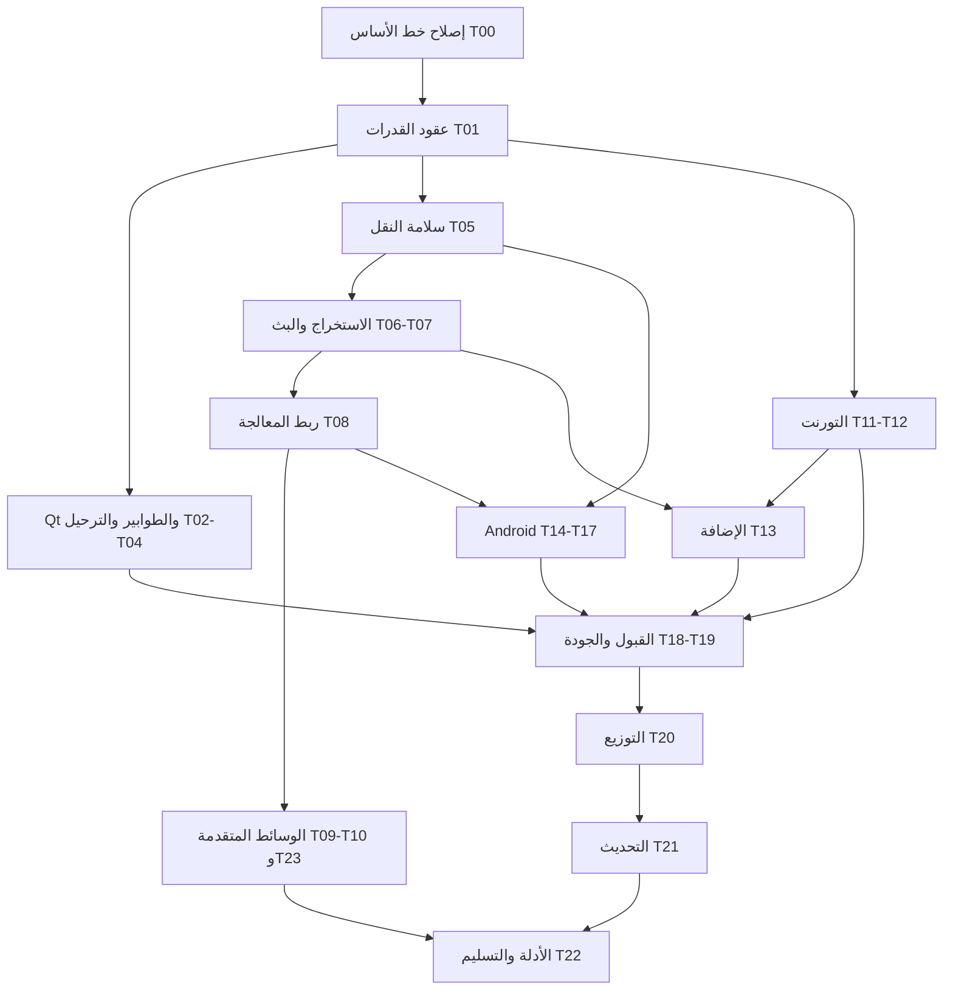

# خطة استكمال الميزات الجديدة في NOVA Download Manager

> **For agentic workers:** نفّذ المهام بالترتيب والتبعيات الواردة هنا، باستخدام مهارة `executing-plans` أو تقسيم المهام بين منفذين ومراجع مستقل. علامات `- [ ]` تخص أعمال التنفيذ المستقبلية، وليست أعمالًا أُنجزت عند إعداد الخطة.

**Goal:** تحويل الميزات المدمجة حديثًا إلى مسارات استخدام مكتملة ومختبرة: Qt، والتنزيل المشترك، والوسائط الأصلية، ومعالجة الحاويات، والتورنت، وإضافة المتصفح، وAndroid، والتثبيت والتحديث.

**Architecture:** يمتلك Rust تنفيذ التنزيل والسياسات والتحقق والحفظ. تتولى Qt العرض والتكامل المكتبي، وتتولى Kotlin واجهة Android ودورة حياة النظام والتخزين المصرّح به. تُشتق قدرات جميع العملاء من التنفيذ المتاح فعلًا، وتبقى المحركات المشتركة مستقلة عن الواجهات وعن الخادم المحلي.

**Tech Stack:** Qt 6.8+ / QML / C++20، CMake 3.24+، Rust وlibcurl، Kotlin / Compose، JNI وUniFFI، Manifest V3 / TypeScript / WXT، Node 24+ وpnpm 11.6.0، GitHub Actions.

**Spec:** طلب استكمال جميع الميزات الجديدة، مع النطاق والقرارات في القسمين 2 و3 أدناه. المراجع الموجودة: `docs/NATIVE_UI_MIGRATION.md`، `docs/architecture/NATIVE_MEDIA_CORE.md`، `docs/architecture/NATIVE_MEDIA_PROCESSING_CORE.md`، `docs/architecture/NATIVE_TORRENT_CORE.md`، `docs/android/feature-parity.md`. عند تعارضها مع الكود، يُسجّل التعارض ويُعالج؛ لا تُعامل ادعاءات الإنجاز القديمة كدليل تشغيل.

**تاريخ المراجعة:** 2026-09-27. **الإصدار في الملفات:** `2.4.49-alpha`.

**خط الأساس:** الفرع `main` عند `429e7062c9a7ecf3c51672315462c4caf3466c4b` من [المستودع](https://github.com/Alaa91H/NOVADownloadManager). جُلبت نسخة محلية إلى `D:\NOVADownloadManager` لأن المجلد كان فارغًا. لم تُعدّل ملفات المنتج ولم تُدمج طلبات دمج أثناء إعداد هذه الخطة.

## 1. نتيجة المراجعة وحدود الإثبات

العمل المطلوب هو **استكمال التكامل والتحقق أولًا، ثم تنفيذ القدرات الناقصة**. توجد بالفعل كمية كبيرة من التنفيذ؛ إعادة بناء المحركات من البداية ستكرر العمل، بينما الاكتفاء بتحديث الوثائق سيترك فجوات فعلية في المنتج.

مصادر المراجعة: الشجرة الحالية، تاريخ الدمج، الوثائق، نتائج فحوص محلية خفيفة، وحالة GitHub Actions وطلب الدمج المفتوح. لم يُشغّل بناء Qt/Rust/Android كامل محليًا، ولم تُجر اختبارات أجهزة أو متصفحات فعلية. أوامر الاختبار لاحقًا هي خطة تحقق مستقبلية ما لم يُذكر صراحة أنها شُغّلت.

| الدليل | النتيجة وقت المراجعة | أثره في الخطة |
|---|---|---|
| [دمج الميزات #206](https://github.com/Alaa91H/NOVADownloadManager/pull/206) | دمج واجهة Qt، والوسائط الأصلية، والمعالجة الأصلية، والتورنت، وعمل التثبيت | هو نطاق التكامل الأساسي، مع إضافات Android والنواة المشتركة قبله |
| [CI على main](https://github.com/Alaa91H/NOVADownloadManager/actions/runs/36140606217) | فشل Rust وعمليات بناء سطح المكتب الست؛ نجح مسار Android وCodeQL في تلك المحاولة | نجاح Android لا يثبت جاهزية سطح المكتب أو صحة الميزات على جهاز |
| [إصلاحات #208](https://github.com/Alaa91H/NOVADownloadManager/pull/208) | مفتوح، ورأسه المُراجع `5df4e443`؛ يحتوي إصلاحات Rust وعقود الإضافة | راجعه وأعد استخدام إصلاحاته قبل كتابة إصلاحات مكررة؛ لم يُدمج في خط الأساس |
| [CI لطلب #208](https://github.com/Alaa91H/NOVADownloadManager/actions/runs/36148148464) | اجتاز Rust وAndroid، وتوقفت أهداف سطح المكتب عند فحص accessibility | بناء Qt والاختبارات والتغليف اللاحقة لتلك الخطوة لم تُثبت |
| `node desktop-native/scripts/check-parity.mjs` | فشل محليًا: 36 خطأ، تشمل ملفات CI محذوفة وإشارات خلفية قديمة | إصلاح دليل الجاهزية نفسه دون تحويل الحالات غير المتحققة إلى `covered` |
| `node desktop-native/scripts/check-native-accessibility.mjs` | فشل محليًا عند `DownloadsPage.qml:815`: الفحص يطلب `Theme.focusRing` بينما العنصر يرسم مؤشرًا بـ`Theme.accent` | توحيد رمز التصميم والفحص والتحقق بصريًا؛ لا يعني السجل أن المؤشر غائب تمامًا |
| `node desktop-native/scripts/check-product-copy.mjs` | فشل محليًا بسبب تسميات FFmpeg في `I18nManager.cpp` | تصحيح النص وفق مسار التنفيذ الحقيقي، مع الإبقاء على أسماء التبعيات في التشخيص عند الحاجة |
| فحصا contrast وrelease-localization | نجحا محليًا؛ تطابق الإنجليزية والعربية 598/598 مفتاحًا | نجاح ساكن محدود؛ لا يثبت سلامة RTL أو قارئ الشاشة فعليًا |
| `node desktop-native/scripts/check-localization.mjs` | فشل بسبب technical placeholders في MediaAdvancedPanel ووحدات KB/s | تصنيف النصوص الفنية بدقة، وترجمة الوصف دون تغيير syntax القالب أو وحدات العقد |
| إصدار `v2.4.49-alpha` على GitHub | مسودة بلا أصول مرفوعة وقت المراجعة | لا يجوز وصفه بإصدار مُسلّم أو مكتمل |

### 1.1 فجوات مؤكدة من الكود

1. **الطوابير:** `desktop-native/src/api/NovaApiClient.cpp:804` وما بعده تستدعي `/api/queues` وعملية النقل وإعادة الترتيب. لا تُسجّل الشجرة الحالية هذه المسارات في Rust؛ يوجد مسار أقدم `/api/engine/queue`. اختبارات Qt التي تستعمل خادمًا وهميًا لا تكشف هذا الانقطاع.
2. **Qt والترجمة:** `desktop-native/src/localization/I18nManager.cpp:1800` يستدعي `LegacyI18nCatalog::instance()` رغم حذف تعريفه. هذا تعارض مصدر مرشح لمنع الترجمة؛ لم يُثبت ببناء C++ محلي.
3. **المعالجة الأصلية:** `crates/nova-media-core/src/lib.rs:62` يعيد تصدير `nova-media-processing-core`، لكن مسار الوسائط الحالي لا يستعمله. `src-tauri/src/daemon/native_media.rs:195` يقبل MP4 فقط للـmux الأصلي، بينما مكتبة المعالجة تحتوي دعم WebM/Matroska وMP4؛ وجود المكتبة لا يعني تفعيلها في المنتج.
4. **تورنت الإضافة:** `src-tauri/src/daemon/routes/extension.rs:180` يُعلن `torrentMagnet: false`، ويرفض تحويل مرشحي torrent/magnet في مسار التسليم. كذلك `routes/engine.rs:122` يدرجهما ضمن الأنواع غير المدعومة، رغم وجود محرك تورنت ومسارات خاصة به.
5. **اختبارات المحركات:** `.github/workflows/nova-ci.yml` لا يحتوي تشغيلًا صريحًا لحزم اختبارات stream/media/media-processing/torrent الجديدة؛ نجاح اختبارات mobile أو مجموعة منتقاة من اختبارات الخادم لا يغطيها.
6. **الإصدار:** مهمة `release` تعتمد على `changes` فقط، وتُنشئ tag ومسودة؛ مهمة desktop ترفع preview إلى Actions. يلزم ربط إصدار مرشح بنفس SHA بكل النتائج والأصول، لا الاكتفاء بوجود مسودة أو artifact مؤقت.
7. **Android:** توجد تنزيلات Rust فعلية وتحكم وحفظ مشفر وUIDT/WorkManager، لكن لا يوجد `android/app/src/androidTest` في النسخة المُراجعة. الوجهة التنفيذية الحالية app-private. توجد `NovaNativeCore.resolveMedia()` دون مسار استخدام لها خارج تعريفها؛ ليست ميزة وسائط Android مكتملة.
8. **وسائط Qt:** `NovaApiClient.cpp:1562,1655,1683` ما زال يستدعي `/api/ytdlp/probe` و`/probe-playlist` و`/ffmpeg`، بينما Rust يسجل `/api/media/probe` و`/probe-playlist` و`/postprocess/status`. العميل يفحص `mediaReady` و`engines.ytdlp` بدل العقد الحالي `mediaExtractionReady` و`engines.media`، ويمكن لغياب القائمة أن يسمح بخيارات غير مدعومة.
9. **رسائل الإضافة:** `PopupApp.tsx:687` و`floating-panel.ts:246` يرسلان `ADD_YTDLP_MEDIA` و`OVERLAY_ADD_YTDLP_MEDIA`، بينما schema/router يقبلان `ADD_MEDIA` و`OVERLAY_ADD_MEDIA`. قائمة السماح في `runtime-message-policy.ts` لا تسمح لـpopup برسالتي `ANALYZE_MEDIA` و`ADD_MEDIA`. التحقق بالأنواع لا يكشف ذلك لأن النقل يقبل record عامًا، واختبارات popup تستبدله بمحاكاة.
10. **حالة الحماية في الإضافة:** popup يرسل `drmProtected`، لكن schema الخاصة بالإضافة لا تحفظه، وrouter يرسل `false` في مسار add. المطلوب حفظ الإشارة والتحقق المستقل بالخادم؛ هذه فجوة عقد، وليست إثباتًا بأن تنزيل محتوى محمي ينجح.

### 1.2 تضارب الوثائق الذي يجب إزالته

- README الحالي يصف Qt بوصفه الواجهة الوحيدة، بينما أجزاء منه ما زالت تصف تنفيذ الوسائط بأنه yt-dlp/FFmpeg، خلافًا لوثيقة الوسائط الأصلية وحذف Media Bridge.
- `desktop-native/README.md` ووثائق Android وبعض تقارير التدقيق تتحدث عن واجهة Tauri قديمة أو مراحل سابقة.
- `docs/architecture/NATIVE_TORRENT_CORE.md` يحتفظ بفقرات مبكرة تقول إن التورنت معطّل ثم يصف مراحل متقدمة مفعّلة؛ يلزم ملخص حالة واحد في أوله.
- `docs/architecture/NATIVE_MEDIA_PROCESSING_CORE.md` يصف تكاملًا نهائيًا لا تثبته مواضع استدعاء المكتبة الحالية.
- مصفوفة Android تصف بعض المنجزات بوصفها خططًا، بينما وثيقة media تقول «لا نقل بعد» رغم وجود النقل المباشر. لا تعالج المشكلة بوضع كل شيء «مكتمل»، بل بفصل تنفيذ المصدر عن اختبار الجهاز.

## 2. النطاق ومصفوفة الإنجاز المستهدف

هذه الخطة تشمل الميزات المضافة في الشجرة وواجهاتها المعلنة، لا كل بروتوكول أو codec ممكن. الفقرات المؤجلة صراحة تبقى ظاهرة في مصفوفة القدرات ولا تختفي من التقرير.

| المسار | الموجود حاليًا | ما يُعد استكمالًا | المهام |
|---|---|---|---|
| Qt الأصلي | Shell، جدول، inspector، إعدادات، tray، طوابير وجدولة ووسائط | بناء ناجح وربط بالخادم الحقيقي وترحيل إعدادات واختبارات استخدام | T00–T04، T18 |
| التنزيل المشترك | ranges، هوية المورد، checkpoints، تقسيم ودمج | تطابق سلوك desktop/mobile مع أعطال الشبكة والملف والعملية | T05، T15 |
| الاستخراج الأصلي | YouTube، مباشر، HLS/DASH، قوائم، سياق طلب، sidecars | مسار تحليل/اختيار/تنزيل واستعادة كامل مع أخطاء صريحة | T06–T07 |
| المعالجة الأصلية | parsers وmuxers وحاويات واختيار pipeline | استعمالها فعليًا بدل وجودها كاعتماد غير مستهلك | T08 |
| القدرات المتقدمة للوسائط | عقود أو حدود معلنة للتحويل والإدراج والقص | تنفيذها على مراحل مع fixtures وتفعيل دقيق لكل قدرة | T09–T10 |
| خيارات الوسائط المتقدمة | مفاتيح واجهة مع رفض/تعطيل لبعض القيم | قوالب أسماء وأرشيف وتوازي وسياسات شبكة فعلية، وسجل صريح للبقية | T23 |
| التورنت | metainfo، magnet، peers، trackers، storage، seeding، DHT، telemetry | إكمال واجهات المنتج، والاتصال ثنائي المكدس، والتسليم والاستعادة | T11–T12 |
| إضافة المتصفح | كشف، overlay، pairing، نقل محلي، استعادة MV3 | عقود متوافقة مع المحركات الجديدة وE2E على الحزم المثبتة | T01، T13 |
| Android | Compose، متصفح، native transfers، background، encrypted intent | bridge مستقر، تخزين مرئي، تعافٍ وسياسات، وسائط محدودة معلنة، اختبارات جهاز | T14–T17 |
| الجودة والتوزيع | بوابات ساكنة وCI وpreview وفحص تحديث | اختبارات المحركات والأهداف الست ومثبتات وتحديث موقّع وتسليم قابل للتحقق | T18–T22 |

### مستويان واضحان للتسليم

- **M1 — إكمال الميزات الموجودة للمستخدم:** جميع مسارات الربط والتشغيل والاعتمادية والتثبيت والتحديث. لا يُفعّل codec أو خيار لم يُنفّذ. يشمل T00–T08، T11–T22، مع الجزء المتاح والمختبر فقط من وسائط Android.
- **M2 — استكمال واجهات الوسائط المتقدمة المعلنة:** الإدراج والفصول والقص والتحويل الصوتي والفيديو وخيارات الوسائط في T09–T10 وT23. يبقى مستوى الإنجاز الكلي «غير مكتمل» حتى إنجاز هذه البنود أو صدور قرار نطاق صريح يغيّر المتطلبات؛ لا يُحسب تأجيلها إنجازًا.
- **خارج الميزات المضافة:** BitTorrent v2، uTP، UPnP/NAT-PMP، hardware acceleration، لغات Qt إضافية، مزامنة سحابية، متجر إضافات، أو تورنت Android. لا تُضاف إلى المسار الحرج دون طلب منتج مستقل؛ يُعرض عدم دعمها بوضوح حيث يلزم.

## 3. القيود والقرارات العامة — Global Constraints

- Qt/QML هي واجهة سطح المكتب؛ لا تُستعاد React/Tauri كحل لأعطال الدمج. مجلد `src-tauri` اسم تاريخي للخادم الحالي.
- لا يُنسخ محرك تنزيل إلى C++ أو Kotlin؛ الشبكة وتخطيط ranges والتحقق والسياسات المشتركة ملك Rust.
- الوسائط الأصلية لا ترجع تلقائيًا إلى yt-dlp أو Media Bridge عند فشل الاستخراج. الخيارات غير المدعومة تُرفض بسبب واضح.
- لا يُعلن دعم عملية لمجرد وجود enum أو parser أو خيار في واجهة. يلزم تنفيذ واستدعاء واختبار قبول للتركيبة المعنية.
- الإنجليزية والعربية هما نطاق إصدار Qt الحالي؛ يُختبر RTL وتبديل اللغة دون فقدان الحالة. نطاق لغات Android والإضافة يُراجع مستقلًا.
- Android الحالي: `minSdk=26`، `compileSdk=37`، `targetSdk=37`، NDK `28.2.13676358`، Java 17، bridge API `3`. هذه قيم مصدر مثبتة هنا، وليست توصية بتحديثها.
- Windows/Linux/macOS: x64 وARM64 لكل منصة. لا يستعاض عن اختبار binary ARM64 بتجميع x64 في حزمة اسمها ARM64.
- التعافي لا يقبل أجزاء لمورد تغيّر ETag/Last-Modified/الهوية الموثوقة الخاصة به، ولا يُعلن اكتمالًا قبل تحقق المخرجات وحفظها.
- credentials وcookies وروابط التوقيع تبقى خارج logs وinfo-json وتقارير القبول. إعادة التفويض بعد restart أفضل من تخزين سياق مصادقة غير آمن.
- لا يُعاد كتابة tag منشور أو استبدال تاريخه. رقم الإصدار التصحيحي يُختار بعد قراءة آخر حالة remote عند التنفيذ؛ لا تفترض الخطة أن رقمًا جديدًا محجوز.
- لا تُخفّف بوابات parity أو الأمن لتمرير إصدار. `releaseReplacementReady` نتيجة أدلة، وليس مفتاحًا لتجاوزها.
- ملفات **إنشاء** في المهام أسماء مقترحة؛ ملفات **تعديل** موجودة في خط الأساس. تُراجع المسارات مجددًا بعد إدماج #208.

### Review Focus — خمس حالات حرجة موزعة على الاختبارات

| الحالة | السلوك المتوقع | مكان تثبيتها |
|---|---|---|
| مورد يتغير مع بقاء حجمه نفسه | إسقاط أجزاء الهوية القديمة، وعدم خلط بايتات | T05 |
| إغلاق أثناء الدمج أو وصول completion بعد pause/cancel | generation قديم لا يكتب ولا يُتم المهمة الجديدة | T05، T07، T08، T15 |
| تفويض صالح ينتقل إلى origin آخر عبر manifest/redirect | عدم تسريب Cookie/Authorization وإظهار طلب إعادة تفويض عند الحاجة | T06، T13، T17 |
| torrent خاص أو tracker ذو token | لا DHT/PEX غير مسموح ولا أسرار في الحفظ والتشخيص | T11–T12 |
| تحديث/ترحيل أو تخزين Android يفقد الإذن منتصف العمل | المحافظة على الحالة والملفات الصحيحة ومسار استرداد مفهوم | T04، T16، T21 |

## 4. الترتيب والتبعيات



العمل المتوازي يبدأ بعد تثبيت عقود T01: منفذ Rust للوسائط، منفذ Qt/desktop، ومنفذ Android/الإضافة، مع مراجعة مشتركة للعقود. صاحب T01 يراجع أي تعديل على serialization أو capability flags. تُنفّذ كل مهمة في تغييرات صغيرة قابلة للمراجعة، دون خلط إعادة هيكلة شاملة مع إصلاح السلوك.

## 5. المهام التنفيذية

### T00 — استعادة خط أساس قابل للبناء قبل إضافة سلوك

**الأولوية:** P0. **المسؤول:** تكامل/CI. **التبعيات:** لا شيء.

**تعديل:** `.github/workflows/nova-ci.yml`، `desktop-native/parity/parity-manifest.json`، `desktop-native/scripts/check-parity.mjs`، `desktop-native/src/localization/I18nManager.cpp`، `desktop-native/qml/pages/DownloadsPage.qml`، وملفات Rust التي تثبت أخطاؤها في سجل CI بعد مراجعة #208.

**العقد الناتج:** SHA مرشح قابل للبناء، وجدول أدلة لا يخلط اختبارات static مع runtime.

- [ ] سجّل رأس main ورأس #208 ونتائج jobs الحالية، وافحص diff #208 قبل تبنّي إصلاحاته؛ لا تنسخ تغييرات إصدار أو إعدادات بلا مراجعة.
- [ ] أصلح أخطاء Rust المؤكدة في سجل البناء، ثم افحص الباينريين `nova-native-backend` و`nova-native-host`.
- [ ] استبدل مرجع `LegacyI18nCatalog` المحذوف بمنطق RTL من الكتالوج الحالي، وأضف حالة لغة عربية/إنجليزية إلى `NativeParityTests.cpp`.
- [ ] وحّد لون مؤشر التركيز الموجود مع `Theme.focusRing` إذا كان هو token التصميم المعتمد، أو صحح قاعدة الفحص لتختبر السلوك المعتمد؛ تحقق بصريًا وبلوحة المفاتيح. عالج technical placeholders بقائمة دقيقة دون ترجمة syntax أو إلغاء فحص النصوص.
- [ ] صحح مراجع parity إلى `nova-ci.yml` والملفات الفعلية، وأبقِ signed-updater وE2E والأهداف غير المثبتة في `blocked/partial`. أخطاء queue/scheduler الوظيفية تنتقل إلى T02 وتبقى عوائق، ولا تُزال assertions فقط لإخفائها.
- [ ] نفّذ مجموعة التحقق A وB في القسم 6، وراجع النتائج على الأهداف الست. افتح إصلاحًا لكل فشل لاحق بدل إعلان نجاح بناء لم تصل إليه CI.

**القبول:** ترجمة Rust وQt ونجاح فحوص البناء المصححة، مع قائمة دقيقة بما بقي معطّلًا. يُعاد فحص parity ويجب زوال أخطاء الملفات المحذوفة؛ نجاحه الكامل يعتمد أيضًا على T02 وربط الوسائط. يستمر `--require-complete` بالفشل إلى أن تكتمل بوابات الإنتاج. لا تعدّل `releaseReplacementReady` هنا ولا تتجاوز gate في CI لإخفاء عمل متبقٍ.

### T01 — توحيد عقود القدرات وحالات المهمات بين العملاء

**الأولوية:** P0. **المسؤول:** Rust + مراجعي Qt والإضافة وAndroid. **التبعيات:** T00.

**تعديل:** `src-tauri/src/daemon/engine_capabilities.rs`، `src-tauri/src/daemon/routes/engine.rs`، `src-tauri/src/daemon/routes/extension.rs`، `crates/nova-core-model/src/lib.rs`، `desktop-native/src/api/NovaApiClient.cpp`، `browser-extension/src/contracts/capabilities.schema.ts`، `browser-extension/src/bridge/bridge-manager.ts`.

**إنشاء:** `docs/contracts/runtime-capabilities.json`، `scripts/check-runtime-contract.mjs`، `browser-extension/src/tests/contract/native-capabilities.test.ts`.

**مدخلات:** القدرات الحقيقية لكل محرك. **مخرجات:** fixtures نسخة ناجحة ونسخة معطلة وجزئية، وتوثيق wire fields الحالية؛ يحافظ media على `mediaExtractionReady` و`streamingReady` و`postProcessingReady` دون إحياء `mediaReady` المحذوف.

- [ ] استخرج response shapes من الخادم ومن schemas المستهلكين وحدد الفرق، بما فيه `torrentMagnet` وتفاصيل الحاوية/codec بدل جاهزية معالجة إجمالية مضللة.
- [ ] احفظ أمثلة من daemon اختباري معروف الإعداد، مع رقم نسخة العقد؛ الحقول الجديدة تكون إضافية أو تُرفع نسخة العقد عند كسر التوافق.
- [ ] أضف اختبار رفض قدرة غير معروفة أو مفقودة؛ العميل يعطل الإجراء مع سبب واضح ويستمر بعرض التنزيل المباشر.
- [ ] وحّد حالات `preparing/probing/downloading/retrying/recovering/paused/merging/completed/failed/cancelled` وما يدعمه النموذج فعلًا؛ وثّق mapping المنصات بدل اعتبار الحالة غير المعروفة مكتملة.
- [ ] صحح Qt إلى `/api/media/probe` و`/api/media/probe-playlist` و`/api/media/postprocess/status`، وإلى `engines.media` وحقول readiness الحالية؛ احذف الافتراض «القائمة المفقودة تعني مسموح». احتفظ بـ`engines.curl` alias ما دام الخادم يدعمه؛ اختلاف الاسم هنا وحده ليس عطلًا.
- [ ] أصلح أسماء رسائل popup/overlay وقائمة sender policy والعقد معًا إلى `ANALYZE_MEDIA` و`ADD_MEDIA` و`OVERLAY_ADD_MEDIA` بحسب المرسل المسموح، وأضف اختبارًا يمر عبر schema ثم policy ثم router. هذه خطوة P0 مستقلة عن استكمال torrent في T13.
- [ ] اجعل الخادم يعيد فحص القدرة عند إنشاء المهمة، حتى لو كان العميل يستعمل snapshot قديمًا.

**القبول:** نفس fixtures تُستهلك في Rust وQt وTypeScript، ولا يمكن لواجهة أن تُفعّل مسارًا يرفضه الخادم بوصفه غير متاح. التحقق A وB وC، واختبار `check-runtime-contract.mjs` بعد إنشائه.

### T02 — إكمال الطوابير والجدولة مع الخادم الحقيقي

**الأولوية:** P0. **المسؤول:** Rust + Qt. **التبعيات:** T01.

**تعديل:** `desktop-native/src/api/NovaApiClient.cpp`، `desktop-native/qml/pages/QueuePage.qml`، `desktop-native/qml/pages/SchedulerPage.qml`، `desktop-native/qml/components/QueueSettingsPanel.qml`، `src-tauri/src/daemon/routes/mod.rs`، `src-tauri/src/daemon/engine/scheduler.rs`، `src-tauri/src/daemon/persist.rs`.

**إنشاء:** `src-tauri/src/daemon/routes/queues.rs`، `desktop-native/tests/RuntimeContractTests.cpp`؛ تسجيل الاختبار في `desktop-native/CMakeLists.txt`.

**الواجهة المنتجة:** تنفيذ `/api/queues` وعمليات CRUD/reorder/move التي يستعملها `NovaApiClient` حاليًا، بعد تثبيت JSON والـverbs من ذلك العميل. `/api/engine/queue` القديم يظل متوافقًا أو يُرحّل صراحة.

- [ ] أضف اختبار تشغيل daemon حقيقي يفشل على إنشاء طابور فارغ واستعادته؛ لا يكفي الرد الوهمي `200`.
- [ ] أنشئ كتالوج طوابير مستقلًا عن وجود مهمات، مع هوية ثابتة وحفظ ذري والتحقق من التكرار والحدود.
- [ ] اربط نقل المهمة وإعادة الترتيب والأولوية والتوازي وحدود السرعة بمحرك التنفيذ، وتحقق من عدم فقدان ترتيب المهام بعد restart.
- [ ] أكمل الجدولة: أيام مخصصة، نافذة تعبر منتصف الليل، المنطقة الزمنية/DST، التشغيل مرة واحدة، تعطيل الخطة بعد تحققها، وتأخير retry.
- [ ] صِل scheduler tick وسياسة temporary bandwidth/profile وcompletion actions بالخادم؛ أعد `powerCommandsEnabled` و`exitRequested` وفق العقد الذي يستعمله Qt، مع opt-in وأثر واحد لكل completion edge. لا تختبر shutdown فعليًا على جهاز العمل؛ استخدم power adapter وهميًا ثم VM مخصصة.
- [ ] عالج حذف طابور يحتوي مهام بسياسة صريحة: نقل المهام إلى الافتراضي أو رفض الطلب مع سبب؛ لا تحذف الملفات ضمنيًا.

**القبول:** من Qt أنشئ طابورًا وأضف مهمتين وحدد concurrency=1؛ تعمل مهمة واحدة، ثم التالية؛ بعد إعادة تشغيل الخادم يبقى الطابور والجدول. الاختبارات B واختبار daemon للعقد، مع حالات DST والنافذة الليلية والطابور الفارغ.

### T03 — إكمال واجهة Qt لكل مسار جديد

**الأولوية:** P1. **المسؤول:** Qt. **التبعيات:** T01–T02؛ تكامل تدريجي مع T06–T13.

**تعديل:** `desktop-native/qml/pages/DownloadsPage.qml`، `desktop-native/qml/pages/MediaDownloaderPage.qml`، `desktop-native/qml/components/MediaAdvancedPanel.qml`، `desktop-native/qml/components/DownloadDetailsPanel.qml`، `desktop-native/src/models/DownloadListModel.cpp`، `desktop-native/src/api/NovaApiClient.cpp`، `desktop-native/tests/NativeParityTests.cpp`.

**إنشاء:** `desktop-native/qml/components/TorrentDetailsPanel.qml`، `desktop-native/qml/components/TorrentAddDialog.qml` إذا لم يكن هناك سطح مكافئ بعد إصلاح خط الأساس؛ تسجيلهما في CMake.

- [ ] اعرض lifecycle الكامل دون إظهار 100% أثناء الدمج/التحقق، وبسرعة نقل صفرية أو غير معروضة حين لا يجري نقل.
- [ ] اربط اختيار جودة/صوت/حاوية/ترجمة/قائمة تشغيل بالـdescriptor الحالي؛ عند إعادة التحليل ألغِ format IDs القديمة وأظهر سبب استبعاد الخيار.
- [ ] أضف عرض التورنت: الملفات وأولويتها، peers/trackers، bytes uploaded، ratio، وقت seeding وحدوده، وحالة metadata pending.
- [ ] أكمل عمليات add/batch/import/link grabber، والبحث والفرز والأعمدة والاختصارات وtray/open-folder والإشعارات عبر المسارات الحقيقية.
- [ ] اختبر انقطاع SSE وعودة daemon وتسليم نسخة snapshot دون تكرار صفوف أو ضياع تحديد المستخدم، مع قائمة 20,000 مهمة.

**القبول:** سيناريو استخدام كامل لكل نوع مهمة على daemon حقيقي، ومراجعة UI باللغتين. تحفظ mocks لاختبارات عرض منفصلة ولا تستعمل لإثبات التكامل. التحقق B وE.

### T04 — ترحيل بيانات سطح المكتب والإعدادات القديمة

**الأولوية:** P1. **المسؤول:** Qt + تخزين Rust. **التبعيات:** T00–T03.

**تعديل:** `desktop-native/src/settings/NativeSettings.cpp`، `desktop-native/src/platform/BackendBootstrap.cpp`، `src-tauri/src/daemon/persist.rs`، `desktop-native/tests/NativeParityTests.cpp`.

**إنشاء:** `desktop-native/src/settings/LegacySettingsMigration.cpp` و`.h`، `desktop-native/tests/fixtures/legacy-settings/`؛ تحديث CMake.

- [ ] جهّز fixtures مصطنعة من schemas القديمة لوجهة الحفظ واللغة والثيم والـqueues والأعمدة، ومن snapshot يتضمن مهمة Media Bridge قديمة.
- [ ] أضف migration version ونسخة احتياطية محلية وكتابة ذرية؛ اجعل إعادة تشغيل الترحيل idempotent.
- [ ] لا تنقل أسرار local storage إلى إعدادات نصية. أعد طلب التفويض عندما يتطلب مخزن الأسرار ذلك.
- [ ] أبقِ ملفات التنزيل القائمة ومسار بيانات daemon؛ مهمة `media-bridge` غير المنتهية تصبح `engine-retired` مع إعادة إضافة الرابط، دون تشغيل محرك محذوف.
- [ ] اختبر snapshot مبتورًا/قديمًا، ومجلد بيانات للقراءة فقط، وعودة الإصدار السابق إلى نسخته الاحتياطية دون فساد.

**القبول:** تثبيت Qt فوق نسخة قديمة يحفظ إعدادات المستخدم والمهمات والملفات، ولا يكرر migration أو يشغّل تنزيلات متوقفة تلقائيًا. التحقق A وB وF.

### T05 — تثبيت سلامة التنزيل المشترك والاستئناف والتقسيم

**الأولوية:** P0. **المسؤول:** Rust. **التبعيات:** T00–T01.

**تعديل:** `crates/nova-core-model/src/lib.rs`، `crates/nova-download-core/src/lib.rs`، `crates/nova-mobile-core/src/lib.rs`، `src-tauri/src/daemon/direct.rs`، `src-tauri/src/daemon/persist.rs`.

**إنشاء:** `crates/nova-download-core/tests/recovery_matrix.rs`، `crates/nova-download-core/tests/support/mod.rs` لاختبارات HTTP محلية محدودة الزمن.

- [ ] وسّع fixtures الحالية إلى Range صحيح، خادم يعيد 200 بدل 206، 416، حجم مجهول، redirect، وانقطاع socket قبل/بعد كتابة checkpoint.
- [ ] اختبر نفس الحجم مع ETag مختلف، weak ETag، Last-Modified فقط، هوية غائبة، geometry متغيرة، checksum خاطئ، وضغط Content-Encoding غير ملائم للاستئناف.
- [ ] ثبّت أن كل جيل تنفيذ يمتلك الكتابة وحده؛ اختبر pause/resume/cancel المتزامنة وإشارة completion متأخرة.
- [ ] اختبر نقص القرص وفشل sync/rename وإغلاق العملية أثناء merge؛ لا يعلن completed إلا بعد exact coverage والتحقق من الملف النهائي.
- [ ] شغّل نفس حالات transport المشتركة لمستهلكي desktop/mobile؛ حافظ على اختلاف الحد الأعلى للاتصالات وفق سياسة المضيف.

**اختبار موجود يُستخدم نقطة بداية، دون إعادة اختراعه:**

```powershell
cargo test --manifest-path crates/nova-download-core/Cargo.toml stale_identity_discards_same_size_partial_before_resume
cargo test --manifest-path crates/nova-download-core/Cargo.toml segmented_transfer_downloads_parallel_ranges_and_merges_in_order
```

**القبول:** SHA-256 للناتج يطابق fixture في كل مسار ناجح؛ في الفشل لا يوجد ملف نهائي مزعوم، وتبقى checkpoint صالحة أو تُزال وفق سبب الإلغاء. التحقق A.

### T06 — استكمال الاستخراج الأصلي والاختيار والتفويض

**الأولوية:** P1. **المسؤول:** Rust media. **التبعيات:** T01، T05.

**تعديل:** `crates/nova-media-core/src/youtube.rs`، `youtube_player.rs`، `selection.rs`، `generic.rs`، `src-tauri/src/daemon/native_media.rs`، `src-tauri/src/daemon/routes/extension.rs`، `crates/nova-media-core/tests/youtube_player_regression.rs`.

**إنشاء:** `crates/nova-media-core/tests/authorized_media_context.rs`، `crates/nova-media-core/tests/fixtures/` لعينات اصطناعية/مسموح بتوزيعها.

- [ ] اربط analyze/probe/resolve/download باستخراج أصلي واحد؛ ثبّت عدم fallback عند challenge أو format غير مدعوم.
- [ ] وسّع corpus عائلات تحويل player المعروفة باختبارات نجاح ورفض؛ أي عائلة غير معروفة تعطي حالة عدم دعم قابلة للتشخيص دون تنفيذ JavaScript اعتباطي.
- [ ] اختبر explicit format، أفضل جودة متوافقة، audio-only، اختيار لغة subtitles، وplaylist pagination مع حدود العدد وإلغاء العملية وإزالة التكرار.
- [ ] اختبر precedence لسياق الطلب، رفض headers التي يملكها transport، ونطاق Cookie/Authorization عبر origins والـsidecars وAES keys.
- [ ] أكمل مسار إعادة التفويض عند انتهاء URL أو إعادة التشغيل. يحتفظ Firefox cookie import بكونه اختيارًا صريحًا؛ Chrome/Edge غير المدعوم لا يوحي بوجود استيراد ناجح.

**القبول:** تنزيل فعلي من fixtures لكل نوع موثق، ورفض واضح للـDRM والـchallenge غير المدعوم والرابط المنتهي؛ لا URL أو header حساس في snapshots/diagnostics. التحقق A وC وE.

### T07 — ربط HLS/DASH متعدد المسارات والتعافي من البث الحي

**الأولوية:** P1. **المسؤول:** Rust stream/media. **التبعيات:** T05–T06؛ يحتاج T08 لإخراج الحاويات الجديدة.

**تعديل:** `crates/nova-stream-core/src/lib.rs`، `crates/nova-media-core/src/hls_transfer.rs`، `hls_live.rs`، `dash_transfer.rs`، `dash_live.rs`، `assembly.rs`، `src-tauri/src/daemon/native_media.rs`.

**إنشاء:** `crates/nova-media-core/tests/stream_task_recovery.rs`، `crates/nova-media-processing-core/src/mpeg_ts.rs`، `crates/nova-media-processing-core/tests/mpeg_ts_remux.rs`؛ تسجيل الوحدة في المكتبة.

- [ ] أكمل اختيار video+audio المنفصل في HLS وDASH وتوحيد الخطة والتقدم والإنهاء، دون تنزيل manifest كنص بوصفه الفيديو النهائي.
- [ ] غطِّ master variants، init maps، byte ranges، discontinuities، تغير period/timeline، وانتهاء/تدوير AES-128 key.
- [ ] أكمل MPEG-TS demux اللازم لتحويل HLS TS أصليًا: PAT/PMT/PES، حدود packets، timestamps wrap/discontinuity وربط codec configuration. `mpeg_ts_demux` معطل حاليًا؛ تجميع TS وحده لا يثبت إمكانية remux إلى MP4/WebM. فعّل التحويل فقط بعد اجتياز fixtures الصوت والفيديو والتلف.
- [ ] اربط committed-part checkpoints بهوية manifest/cursor/track، وامنع دمج مقاطع متكررة أو مفقودة بعد crash.
- [ ] عرّف توقف التسجيل الحي: إجراء finish يُتم المقاطع المثبتة، cancel يطبق cleanup، وpause يحتفظ بما يصلح للاستعادة.
- [ ] ثبّت حدود الذاكرة والتوازي ووقت الانتظار عند توقف البث، وحالة خطأ واضحة عندما ينتهي sliding window قبل الاستئناف.

**القبول:** HLS VOD/live وDASH static/dynamic ينتجان ملفًا قابلًا للقراءة بنظام التحقق المستقل، مع A/V sync وعدم إعادة تنزيل المسارات المكتملة. سيناريو crash أثناء آخر مقطع لا يُفسد الناتج. التحقق A وE.

### T08 — توصيل مكتبة المعالجة الأصلية بمسار المنتج

**الأولوية:** P1. **المسؤول:** Rust media processing. **التبعيات:** T01، T05–T06.

**تعديل:** `crates/nova-media-processing-core/src/capabilities.rs`، `pipeline.rs`، `remux.rs`، `progress.rs`، `crates/nova-media-core/src/native_mux.rs`، `youtube_transfer.rs`، `src-tauri/src/daemon/native_media.rs`، `src-tauri/src/daemon/routes/engine.rs`.

**إنشاء:** `crates/nova-media-core/tests/native_processing_integration.rs`.

**الواجهة:** استخدم `nova_media_core::processing` ومخطط المكتبة الحالي؛ لا تُضف muxer ثالثًا. الناتج العملية المدعومة فعليًا، وحالة تقدم وإلغاء مرتبطة بنفس task generation.

- [ ] اكتب regression يثبت أن مسار مهمة حقيقي يقبل WebM/Matroska المدعوم بعد الربط، وأن MP4 القديم لا يتراجع.
- [ ] استبدل قرار `container == mp4` بقرار يجمع input probe وcodec configuration وoutput container وoperation capability.
- [ ] صِل MP4/fMP4/WebM/Matroska بالمكتبة الجديدة، مع FLAC/AAC/Opus/H.264/HEVC/VP8/VP9/AV1 حسب المصفوفة الفعلية لا اسم codec وحده.
- [ ] حافظ على DTS/PTS وB-frames وOpus pre-skip/discard padding وchannel/sample-rate واللغة؛ ارفض configuration غير صالحة قبل إنشاء الملف النهائي.
- [ ] اجعل كتابة المخرجات مؤقتة ثم atomic commit، والإلغاء قابلًا للملاحظة أثناء packet processing، والتقدم محدود التكرار.
- [ ] بعد إثبات التكافؤ أزل fallback الخارجي من العمليات التي أصبحت أصلية. العمليات الأخرى تظل مقفلة إلى T09–T10، مع توثيق أي adapter انتقالي بدقة.

**مثال اختبار قابل للإضافة داخل وحدة `native_media.rs` بعد الربط:**

```rust
#[test]
fn native_container_policy_includes_wired_copy_mux_targets() {
    for container in ["mp4", "webm", "mkv"] {
        assert!(native_mux_supports_container(container));
    }
    assert!(!native_mux_supports_container("unknown-container"));
}
```

هذا الاختبار يثبت سياسة الحاوية فقط؛ يلزم اختبار fixture حقيقي لكل codec/container ومخرج قابل للقراءة قبل إعلان دعمها.

**القبول:** تعمل التركيبات المعتمدة ببيئة لا تحتوي executables خارجية، مع fixture تتجاوز 4 GiB منطقيًا لاختبار co64 دون تحميل payload كامل في الذاكرة. التحقق A وE.

### T09 — الترجمات والبيانات والفصول والقص

**الأولوية:** P2، ضمن M2. **المسؤول:** Rust media processing + Qt. **التبعيات:** T07–T08.

**تعديل:** `crates/nova-media-processing-core/src/types.rs`، `job.rs`، `pipeline.rs`، `mp4/muxer.rs`، `ebml_muxer.rs`، `src-tauri/src/daemon/native_media.rs`، `desktop-native/qml/components/MediaAdvancedPanel.qml`.

**إنشاء:** `crates/nova-media-processing-core/src/subtitles.rs`، `metadata.rs`، `chapters.rs`، `clip.rs`، `crates/nova-media-processing-core/tests/metadata_and_clip.rs`؛ تسجيل الوحدات في `src/lib.rs`.

- [ ] ثبّت mapping sidecar مقابل embedded لكل حاوية؛ فعّل فقط subtitle formats ذات تمثيل مدعوم، مع رفض البقية دون إسقاط صامت.
- [ ] نفّذ metadata/thumbnail/chapter embedding بحدود حجم وترميز ولغة واضحة، مع استمرار دعم sidecars الحالية.
- [ ] نفّذ split by chapters وtime-range clip مع إعادة تأسيس timestamps وحدود المسار، ووضّح للمستخدم الفرق بين قطع keyframe وقطع دقيق يتطلب transcoding.
- [ ] اختبر العربية والترميزات المختلفة واللغة المفقودة وchapter timestamps المتداخلة والصورة المعطوبة والمدى خارج مدة الملف.
- [ ] اربط التقدم والإلغاء والـcleanup لكل output؛ فشل جزء لا يترك ملفًا نهائيًا باسم نجاح.

**القبول:** مقارنة metadata والتوقيت بمخرجات قارئ مستقل في بيئة الاختبار، وحفظ A/V sync؛ لا تعرض الواجهة trim دقيقًا قبل T10. التحقق A وB وE.

### T10 — تنفيذ التحويل الصوتي والفيديو خلف قدرات دقيقة

**الأولوية:** P2، ضمن M2. **المسؤول:** media processing. **التبعيات:** T08–T09.

**تعديل:** `crates/nova-media-processing-core/Cargo.toml`، `src/capabilities.rs`، `src/job.rs`، `src/pipeline.rs`، `src/types.rs`، `src-tauri/src/daemon/native_media.rs`.

**إنشاء:** `docs/architecture/NATIVE_CODEC_BACKENDS.md`، `crates/nova-media-processing-core/src/codec/mod.rs`، `src/transcode.rs`، `tests/transcode_acceptance.rs`.

- [ ] نفّذ تقييمًا محدودًا لمدة 3–5 أيام لمكتبات decoder/encoder داخل العملية: الدعم الفعلي للـABI، جودة الإخراج، الإلغاء، التراخيص والتوزيع، وحجم الحزمة. وثّق القرار ومصفوفة codec بدل اختيار مكتبة على أساس اسمها فقط.
- [ ] ابدأ باستخراج PCM/WAV وFLAC ثم MP3 عبر backend داخل العملية تقرّه المراجعة؛ ميّز stream copy عن transcoding في العقد والواجهة.
- [ ] نفّذ عقد decoder → audio/video frames → encoder مع resampling/channel layout وتزامن timestamps وحدود الذاكرة وthread count.
- [ ] أكمل أول مسار فيديو CPU مُعتمد في المصفوفة، ثم أضف التركيبات المتبقية تدريجيًا؛ لا تُعلن «تحويل فيديو عام» ما دام codec محدد غير متاح.
- [ ] اختبر clipping الدقيق، والتحويل أثناء pause/cancel، والحرارة/الضغط/نقص المساحة؛ لا تتسلل subprocess calls إلى المكتبة الأصلية.
- [ ] أبقِ hardware acceleration غير مفعّل حتى يكون له تنفيذ واختبارات مستقلة؛ ليس شرط M2 الحالي.

**القبول:** ملفات مرجعية بصوت/فيديو وtiming معروف؛ duration وخطأ التزامن والجودة ضمن حدود تُثبت في قرار backend قبل التفعيل. capability خاص بكل عملية/codec/platform، واختبارات offline ناجحة على المنصات المستهدفة. التحقق A وE.

### T11 — إكمال إدخال التورنت وعرضه وحفظ سياساته

**الأولوية:** P1. **المسؤول:** Rust torrent + Qt. **التبعيات:** T01، T03، T05.

**تعديل:** `src-tauri/src/daemon/routes/torrent.rs`، `native_torrent.rs`، `torrent_task.rs`، `torrent_storage.rs`، `torrent_policy.rs`، `torrent_seeding.rs`، `persist.rs`، `desktop-native/src/api/NovaApiClient.cpp`، لوحتي التورنت في T03.

**إنشاء:** `src-tauri/tests/torrent_task_acceptance.rs` لتشغيل binary daemon مع swarm محلي، أو وحدة integration داخل daemon إذا تعذّر تصدير internals دون توسيع API.

- [ ] اختبر magnet وملف `.torrent` محلي ورابط metainfo وفق مسار دخول مخصص؛ عرض metadata والملفات قبل التنفيذ حيث يمكن.
- [ ] صِل اختيار الملفات وأولويتها وpause/resume/remove/seeding limits بالـruntime، مع معالجة pieces المشتركة بين ملف مطلوب وآخر مستبعد.
- [ ] اختبر حفظ bitfield وعدادات upload/download والـratio وإعادة التحقق بعد crash وفساد piece؛ لا تثق بـcheckpoint بدل hash.
- [ ] ثبّت private-torrent policy: تعطيل DHT/PEX غير المسموح وتفويض tracker وإعادة طلب أسراره عند فقدها.
- [ ] اختبر system-open وmagnet registration والطلب الثاني أثناء تشغيل التطبيق، مع منع إنشاء مهمة مكررة لنفس info-hash دون اختيار صريح.

**القبول:** swarm محلي من seed وpeerين يكمل متعدد الملفات، ثم يستأنف بعد restart ويطبّق ratio/time caps. نجاح parsing فقط لا يكفي. التحقق A وB وE وF.

### T12 — إنهاء تورنت IPv6 والمراقبة الحية

**الأولوية:** P1. **المسؤول:** Rust networking. **التبعيات:** T11.

**تعديل:** `src-tauri/src/daemon/torrent_seed.rs`، `torrent_peer.rs`، `torrent_dht.rs`، `torrent_telemetry.rs`، `torrent_bandwidth.rs`، `crates/nova-torrent-core/src/lib.rs` والملفات البروتوكولية التي يصدرها.

**إنشاء:** `src-tauri/tests/torrent_dual_stack.rs`.

- [ ] أكمل inbound TCP listener لعائلتي IPv4/IPv6 مع سلوك واضح عندما تتوفر إحداهما فقط، واغلق endpoints القديمة عند فشل إعادة الربط.
- [ ] اربط IPv6 DHT announce بعنوان/منفذ seed صالح ومتاح فعلًا؛ لا تقلب القدرة إلى true بسبب نجاح UDP وحده.
- [ ] أكمل telemetry: choke/interest، availability، rolling upload/download rates، tracker/DHT حالة ووقت آخر نجاح؛ استخدم snapshots محدودة بلا قفل يبطئ hot path.
- [ ] تحقق من token rotation وrouting persistence وbounded peer counts/retries ومن توقف advertising مع pause/remove/shutdown أو بلوغ حد seeding.
- [ ] اختبر فساد peers وoversized frames وtracker redirects وDNS rebind والسياسة الداخلية للعناوين، مع fixtures محلية تسمح localhost صراحة للاختبار فقط.

**القبول:** inbound transfer وseeding وannounce ناجحة على IPv4 وIPv6، وفشل عائلة لا يمنع الأخرى ولا يُعلن endpoint وهميًا. private torrent لا يتسرب إلى DHT/PEX. التحقق A وE.

### T13 — استكمال إضافة المتصفح والتسليم لكل محرك

**الأولوية:** P1. **المسؤول:** extension + runtime. **التبعيات:** T01، T06–T08، T11.

**تعديل:** `browser-extension/src/capture/torrent-magnet-capture.ts`، `src/contracts/capabilities.schema.ts`، `src/contracts/messages.schema.ts`، `src/security/runtime-message-policy.ts`، `src/background/message-router.ts`، `src/ui/popup/PopupApp.tsx`، `src/content/floating-panel.ts`، `src/bridge/bridge-manager.ts`، `src/content/overlay-ui.ts`، `src/bridge/pairing-manager.ts`، `src-tauri/src/daemon/routes/extension.rs`، `src-tauri/src/daemon/routes/engine.rs`، `docs/extension/NOVA_EXTENSION_FEATURE_SYNC.md`.

**إنشاء:** `browser-extension/src/tests/contract/native-torrent-handoff.test.ts`، `browser-extension/tests/browser/native-runtime-handoff.spec.ts`؛ تأكد من إدراج الملف في Playwright config.

- [ ] نفّذ converter مخصصًا لمرشح magnet/torrent إلى عقد محرك التورنت؛ لا تمرره إلى تحقق HTTP المباشر. فعّل `torrentMagnet` بعد نجاح المسار فقط.
- [ ] حدّث unsupportedCandidateMediaTypes وفق القدرات الفعلية، واختبر daemon قديمًا لا يدعم التورنت ليظل الرفض مفهومًا.
- [ ] صِل overlay باستخراج الوسائط الأصلي وخيارات الحاوية الجديدة؛ ألغِ اعتماد جاهزية native extraction على وجود FFmpeg/yt-dlp.
- [ ] حافظ على `drmProtected` بين التحليل والاختيار وschema/router والخادم، مع تحقق الخادم المستقل. عدّل رسائل `overlay-i18n.ts` والـlocales التي ما زالت تقترح إصلاح yt-dlp لكل فشل، وأعد `postProcessor` الحقيقي بدل قيمة FFmpeg ثابتة.
- [ ] وسّع اختبارات popup/overlay لتستخدم حدود runtime الحقيقية؛ mock طلبًا ناجحًا باسم قديم لا يثبت قدرة الرسالة على عبور schema والسياسة.
- [ ] اختبر zero-click pairing وwake وtoken rotation وإعادة التثبيت والهوية Chrome/Edge/Firefox ورفض origins غير المصرح بها.
- [ ] اختبر MV3 worker restart وdownload tracking واستعادة الإشعارات وعدم تكرار المهمة، بما فيه interrupted/paused/completed والحد الحالي للتخزين.
- [ ] نفّذ capture على حزمة extension وdesktop مثبتتين: مباشر، YouTube fixture/مصدر مصرح، HLS، DASH، magnet، torrent، context menu، deep scan، aggressive capture مع permissions الفعلية.

**القبول:** لا نجاح زائف عند فشل التسليم؛ يظهر task ID حقيقي في Qt، ولا تتسرب tokens إلى page scripts. تشغيل C وE على المتصفحات الثلاثة؛ الاختبار بخادم fake يبقى طبقة منفصلة.

### T14 — تثبيت Android bridge والقدرات والربط المولّد

**الأولوية:** P1. **المسؤول:** Android + Rust mobile. **التبعيات:** T01، T05.

**تعديل:** `crates/nova-mobile-ffi/src/lib.rs`، `crates/nova-mobile-ffi/Cargo.toml`، `crates/nova-mobile-core/src/lib.rs`، `android/app/src/main/java/com/nova/downloadmanager/core/NovaNativeCore.kt`، `scripts/build-android-ffi.sh`، `android/app/build.gradle.kts`.

**إنشاء:** `scripts/generate-mobile-bindings.sh`، `android/app/src/androidTest/java/com/nova/downloadmanager/core/NativeBridgeInstrumentedTest.kt`.

- [ ] ثبّت records/enums/errors لجلسة/task/progress/capabilities ونسخة العقد. أبقِ API 3 متوافقًا أو ارفع النسخة بصورة مقصودة مع رفض العميل القديم.
- [ ] ولّد Kotlin bindings بصورة قابلة لإعادة الإنتاج، واستبدل JNI string/JSON الانتقالية تدريجيًا دون تعطيل مسار التنزيل المباشر العامل.
- [ ] اجعل progress محدودًا ومجمّعًا، مع Flow لا يمرر تحديثًا لكل بايت، وإلغاء صريح يربط Rust بمالك التنفيذ Android.
- [ ] اختبر تحميل ABI الصحيح، وغياب `.so`، ونسخة غير متوافقة، وفشل native initialization دون crash للواجهة.
- [ ] اجعل resolveMedia descriptor قدرة منفصلة عن تنفيذ media task؛ لا تستنتج دعم التنزيل من وجود resolver.

**القبول:** handshake وcreate/control/progress تُختبر من Kotlin على جهاز، والبناء المتكرر ينتج bindings متطابقة. اختبارات D؛ نجاح cargo وحده ليس إغلاقًا للمهمة.

### T15 — إكمال دورة حياة Android والتعافي وسياسات الطابور

**الأولوية:** P1. **المسؤول:** Android + shared core. **التبعيات:** T05، T14.

**تعديل:** `android/app/src/main/java/com/nova/downloadmanager/downloads/NovaTransferCore.kt`، `DownloadsRepository.kt`، `SecureTransferIntentStore.kt`، `service/NovaTransferScheduler.kt`، `NovaTransferWorker.kt`، `NovaUserInitiatedTransferJobService.kt`، `NovaTransferNotifications.kt`، `NovaTransferActionReceiver.kt`، `crates/nova-mobile-core/src/lib.rs`.

**إنشاء:** `android/app/src/androidTest/java/com/nova/downloadmanager/downloads/TransferLifecycleTest.kt`، `android/app/src/test/java/com/nova/downloadmanager/downloads/TransferReconciliationTest.kt`.

- [ ] اجعل إنشاء catalog record وencrypted intent قابلًا للتعافي إذا فشلت إحدى الكتابتين؛ المهمة غير القابلة للاستئناف تُعرض بسبب واضح.
- [ ] اختبر pause/cancel كطلب ثم تأكيد توقف native، والتعامل مع ضغط resume أثناء خروج worker السابق؛ لا تعمل جلستان لنفس task ID.
- [ ] صِل Wi-Fi/metered/roaming/battery/storage constraints وسياسة retry/priority/bandwidth المشتركة بجدولة Android دون نسخ خوارزميات Rust إلى Kotlin.
- [ ] اختبر collision لمعرفات JobScheduler المستخرجة من task IDs؛ اجعل mapping ثابتًا ومتحققًا بدل الاعتماد على prefix مختصر وحده.
- [ ] غطِّ API 26 و33 و34+ وtargetSdk الحالي: رفض الإذن، backgrounding، OS stop، process kill، force-stop ثم إعادة فتح، reboot، إبطال مفتاح Keystore.
- [ ] حافظ على explicit user resume بعد force-stop/UIDT stopped؛ reconcile لا يعيد تشغيل task paused تلقائيًا ولا يترك notification ميتة.

**القبول:** checksum صحيح بعد الاستئناف، عامل واحد للمهمة، لا أسرار في backup/logs، والإشعار وحالة Compose يطابقان Rust. تحقق D على emulator وعلى جهاز ARM64 فعلي، مع سجل النظام والنتائج.

### T16 — SAF وMediaStore وفتح الملفات بأذونات صحيحة

**الأولوية:** P1. **المسؤول:** Android storage. **التبعيات:** T14–T15.

**تعديل:** `android/app/src/main/java/com/nova/downloadmanager/downloads/NovaTransferCore.kt`، `app/NovaApp.kt`، `AndroidManifest.xml`، `crates/nova-mobile-ffi/src/lib.rs`، `crates/nova-mobile-core/src/lib.rs`.

**إنشاء:** `android/app/src/main/java/com/nova/downloadmanager/storage/DownloadDestination.kt`، `SafDestinationStore.kt`، `MediaStoreDestinationStore.kt`، `android/app/src/androidTest/java/com/nova/downloadmanager/storage/DestinationLifecycleTest.kt`.

**العقد المقترح الذي تُعرّفه هذه المهمة:**

```kotlin
sealed interface DownloadDestination {
    data object AppPrivate : DownloadDestination
    data class SafTree(val grantId: String) : DownloadDestination
    data object MediaStoreDownloads : DownloadDestination
}
```

`grantId` معرف داخلي؛ URI grant يملكه Android ولا يُعرض كمسار عام لـRust.

- [ ] احتفظ بـapp-private staging القائم، وأضف finalization إلى destination capability المختارة؛ يضمن staging الاستئناف عندما لا يدعم provider seek.
- [ ] نفّذ persistable SAF grants، وسياسة اسم متعارض صريحة، وطلب إعادة اختيار عند سحب الإذن؛ لا تكتب في وجهة بديلة دون طلب المستخدم.
- [ ] نفّذ MediaStore `IS_PENDING` على API 29+؛ API 26–28 يستخدم SAF أو private وفق الاختيار. لا يظهر ملف «مكتمل» قبل التحقق ونجاح finalization.
- [ ] اختبر فشل provider، امتلاء القرص، الإلغاء أثناء النسخ، crash بين النسخ والنشر، وتكرار finalization دون duplicate.
- [ ] افتح/شارك الملفات بـcontent URI وإذن محدود، لا `file://` أو raw private path؛ نظّف فقط الموارد التي تملكها المهمة.

**القبول:** ملفات مرئية ومقروءة خارج التطبيق عند اختيار public destination، ونجاح recovery أو طلب الإذن بوضوح. كل provider-backed حالة ضمن D، دون طلب صلاحيات تخزين واسعة غير لازمة.

### T17 — متصفح Android وربط الوسائط الأصلية

**الأولوية:** P1 للربط المباشر، P2 لتوسيع الوسائط. **المسؤول:** Android + media. **التبعيات:** T06–T08، T14–T16.

**تعديل:** `android/app/src/main/java/com/nova/downloadmanager/browser/BrowserScreen.kt`، `BrowserPolicy.kt`، `BrowserViewModel.kt`، `BrowserSettingsSection.kt`، `app/NovaApp.kt`، `downloads/DownloadsViewModel.kt`، `core/NovaNativeCore.kt`، `crates/nova-mobile-core/src/lib.rs`، `crates/nova-mobile-ffi/src/lib.rs`.

**إنشاء:** `android/app/src/main/java/com/nova/downloadmanager/media/MediaViewModel.kt`، `MediaSelectionScreen.kt`، `android/app/src/androidTest/java/com/nova/downloadmanager/browser/BrowserDownloadHandoffTest.kt`.

- [ ] وسّع capture من URL فقط إلى intake record للـdisplay name/MIME/referrer والسياق المصرح به؛ لا تحفظ headers/cookies ضمن catalog أو state قابل للاستعادة نصيًا.
- [ ] اعرض مراجعة الرابط والوجهة قبل بدء العمل، وميّز HTTP مباشرًا عن صفحة وسائط/manifest؛ blob/data لا يتحولان إلى تنزيل أصلي وهمي.
- [ ] اربط `resolveMedia()` الموجود بواجهة اختيار، ثم نفّذ media task عبر النواة المشتركة ضمن envelope النظام، والتخزين والإلغاء المعرفين في T15–T16.
- [ ] ابدأ direct media وHLS/DASH والتركيبات التي تثبت دعم ABI لها؛ فعّل mux الأصلي بعد اختبار الذاكرة/المعالج/الحرارة على الهاتف. لا تستعمل desktop daemon أو subprocess discovery.
- [ ] اختبر WebView navigation وfile/content schemes وrenderer crash، وحفظ إعدادات clean browsing/user scripts؛ أبقِ scripts باختيار المستخدم ونطاق URL محدد بلا native privileged bridge.
- [ ] حدّث وثيقة Android media من منع شامل قديم إلى مصفوفة runtime دقيقة، مع إبقاء الأجزاء غير المنفذة معطلة.

**القبول:** capture → مراجعة → مهمة Rust → background → ملف نهائي؛ لا يكفي ظهور formats. اختبارات D وfixtures تفويض cross-origin، ورفض DRM/مصادقة مفقودة دون ادعاء نجاح.

### T18 — استكمال الوصول والترجمة وHigh-DPI

**الأولوية:** P1. **المسؤول:** Qt + Android + QA. **التبعيات:** T03، T13، T17.

**تعديل:** `desktop-native/src/localization/I18nManager.cpp`، `desktop-native/qml/Main.qml`، الصفحات والمكونات المذكورة في T03، `desktop-native/tests/DisplayScaleTests.cpp`، `desktop-native/scripts/check-native-accessibility.mjs`، ملفات strings وCompose في Android.

- [ ] أضف المفاتيح الجديدة للوسائط والتورنت والتخزين والأخطاء بالإنجليزية والعربية، وافصل رسائل التشخيص عن copy المستخدم.
- [ ] اختبر RTL للأعمدة والقيم الرقمية والمسارات والاختصارات؛ لا تعكس timeline أو الأيقونات ذات المعنى التقني بلا مراجعة.
- [ ] اختبر keyboard-only، focus restoration بعد dialogs، selection semantics، screen reader announcements للأخطاء والتقدم دون إغراق.
- [ ] شغّل NVDA على Windows وVoiceOver على macOS وOrca على Linux، وTalkBack على Android، ووثّق البيئة والنتيجة.
- [ ] اختبر 100/125/150/200% وشاشتين mixed-DPI، وتكبير النص وتغيير اللغة/الثيم مع نافذة مفتوحة ومهمة نشطة.

**القبول:** لا control أساسي بلا اسم أو وصول بلوحة المفاتيح، ولا نص مقطوع يمنع إجراء، وتطابق المفاتيح والcontrast مستمران. تحقق B وD ومراجعة فعلية موثقة؛ فحص regex وحده غير كافٍ.

### T19 — سد تغطية CI والأمن والأداء

**الأولوية:** P0 للبوابات الأساسية ثم P1 للمصفوفة الكاملة. **المسؤول:** CI/QA + أصحاب المحركات. **التبعيات:** يبدأ بعد T00؛ الإغلاق بعد T05–T18.

**تعديل:** `.github/workflows/nova-ci.yml`، `scripts/security-check.mjs`، `desktop-native/scripts/check-parity.mjs`.

**إنشاء:** `scripts/run-shared-core-tests.mjs`، `docs/verification/NEW_FEATURES_ACCEPTANCE.md`، `crates/nova-media-processing-core/fuzz/Cargo.toml` وأهداف parsing تحت `fuzz/fuzz_targets/` وفق بنية cargo-fuzz.

- [ ] شغّل اختبارات كل crate صراحة: model/download/mobile/ffi/stream/media/media-processing/torrent؛ أضف fmt وclippy وfixture corpus، مع feature matrix لنظم TLS/libcurl ذات الصلة.
- [ ] أضف اختبارات runtime contract الحقيقية من T02/T13، وpackage loading واختبارات Android instrumented بدل الاقتصار على APK/JVM.
- [ ] صحح path filters لتغييرات `crates/**` والعقود؛ أي تغيير مشترك يشغّل مستهلكيه. أضف job تجميعيًا يميز skipped المشروع من عدم تشغيل بوابة مطلوبة.
- [ ] أضف اختبارات malformed input وfuzz محدودة في PR وأطول مجدولة لـMP4/EBML/HLS/DASH/bencode/peer frames، مع حفظ regression corpus.
- [ ] راجع SSRF/redirect/DNS pinning وauth scopes وdestination traversal والـarchive/path handling، وحدود الذاكرة والـtimeouts وعدم تسريب الأسرار.
- [ ] سجّل أداء 20,000 مهمة، transfer throughput، استخدام الذاكرة والـCPU، browser worker storage، Android battery/thermal على fixture ثابتة. أي عتبة جديدة تُثبت ببيئة وbaseline، لا بادعاء رقم غير مقاس.
- [ ] حدّد في jobs مدة قصوى، جمع logs redacted، وعدم مشاركة أسرار signing مع PR غير موثوق.

**القبول:** failure في أي suite جديدة يمنع بوابة التسليم، والنتائج مرتبطة بالـSHA نفسه. التحقق A–E ولا تُعتبر jobs skipped نجاحًا وظيفيًا.

### T20 — استعادة التوزيع النهائي والمثبتات للمنصات الست

**الأولوية:** P1. **المسؤول:** release engineering. **التبعيات:** T04، T13، T18–T19.

**تعديل:** `.github/workflows/nova-ci.yml`، `desktop-native/CMakeLists.txt`، `packaging/README.md`، `scripts/apply-version.mjs`، `scripts/verify-release-asset-manifest.sh`.

**إنشاء:** `packaging/windows/native-installer.nsi`، `packaging/linux/` و`packaging/macos/` لوصفات الحزم الأصلية، `scripts/package-native-release.mjs`، `scripts/generate-release-manifest.mjs`.

- [ ] ابنِ حزمة Qt/runtime/native-host متناسقة من SHA واحد لكل OS/arch، مع Qt plugins وTLS/native libraries والتراخيص وSBOM اللازمة.
- [ ] نفّذ Windows per-user دون UAC وper-machine بصلاحيات مناسبة، ومساري upgrade/uninstall/repair، مع مفاتيح Native Messaging في hive الصحيح لكل scope.
- [ ] تحقق من magnet/file associations ومن startup/single-instance وموقع البيانات بعد نقل الحزمة؛ لا تمس ملفات تنزيل المستخدم عند إزالة البرنامج.
- [ ] أعد توليد Scoop/WinGet وفق أصول Qt الفعلية؛ حافظ على اسم setup تاريخي فقط إذا بقي عقدًا منشورًا يحتاجه المستخدمون، مع أصل user مميز.
- [ ] جهّز حزم Linux/macOS المقبولة وتوقيع/notarization حيث يتطلب مسار التوزيع، واختبرها على نظام نظيف غير مجهز بمكتبات التطوير.
- [ ] ارفع artifacts النهائية إلى مسودة الإصدار مع manifest يحوي version/commit/OS/arch/size/SHA-256. أضف ZIP/XPI الإضافة وAPK الموقّع عند اجتياز بوابات Android، لا debug APK بوصفه إصدارًا نهائيًا.
- [ ] ثبّت version policy للحزم المشتركة؛ ليس اختلاف إصدار crate الداخلي خطأ تلقائيًا. زد Android versionCode تصاعديًا لكل توزيع جديد بدل نسخ رقم سابق.

**القبول:** fresh install وupgrade وuninstall وإصلاح integration لكل scope ومنصة؛ binary architecture صحيحة، وكل أصل في manifest موجود وقابل للتحقق. تحقق F؛ preview Actions ليس بديلًا عن حزمة التوزيع.

### T21 — بناء تحديث موقّع قابل للاستعادة

**الأولوية:** P1 وبوابة إنتاج. **المسؤول:** release + Qt. **التبعيات:** T04، T20.

**تعديل:** `desktop-native/src/platform/UpdaterManager.cpp` و`.h`، `desktop-native/qml/pages/SettingsPage.qml`، `.github/workflows/nova-ci.yml`، `desktop-native/parity/parity-manifest.json`.

**إنشاء:** `desktop-native/src/platform/UpdateInstaller.cpp` و`.h`، `desktop-native/tests/UpdaterSecurityTests.cpp`، `docs/architecture/SIGNED_NATIVE_UPDATER.md`؛ تسجيل CMake.

**الحالي:** updater يفحص GitHub ويفتح صفحة الإصدار؛ لا يثبت ذلك وجود تنزيل/تحقق/تثبيت تلقائي موقّع.

- [ ] وثّق تنسيق manifest موقع ومفتاح تحقق مثبت وسياسة تدوير مفاتيح، وقنوات stable/preview وsemver؛ توقيع نظام التشغيل منفصل عن توقيع metadata.
- [ ] أصلح مقارنة prerelease identifiers مثل `alpha.2` و`alpha.10`، وافحص كل الإصدارات المؤهلة بدل افتراض أن أول عنصر من GitHub هو الأحدث وفق سياسة القناة.
- [ ] تحقق من signature/version/OS/arch/hash/size قبل تنفيذ الحزمة؛ لا يغير HTTP redirect سياسة الثقة.
- [ ] أضف download staging واستئناف آمن، وفحص مساحة القرص، ثم تشغيل installer الصحيح مع الحفاظ على per-user/per-machine.
- [ ] احفظ checkpoint للمهمات وتوقف عن الكتابة قبل الاستبدال؛ اجعل الإلغاء وفشل المثبت وانقطاع الكهرباء قابلة للاستعادة دون تلف الإعدادات.
- [ ] اختبر downgrade غير مصرح، manifest معدل، توقيع/مفتاح خاطئ، architecture خاطئة، شبكة مقطوعة ورفض UAC. يبقى update-check/manual رابطًا صادقًا عندما تكون القدرة التلقائية غير متاحة.

**القبول:** ترقية مثبتة من حزمة أقدم إلى مرشح موقّع على كل منصة معلنة، مع بيانات قبل/بعد ونتيجة rollback. لا تتحول parity إلى covered بناءً على unit signature test وحده. تحقق B وF.

### T22 — توحيد الوثائق وإغلاق الأدلة وتسليم إصدار مرشح

**الأولوية:** P1. **المسؤول:** التكامل + QA. **التبعيات:** جميع مهام مستوى التسليم المختار؛ M2 يتطلب T09–T10 وT23 أيضًا. رقم T23 لاحق في الوثيقة لتنظيم الخيارات، لكن تنفيذه يسبق إغلاق T22 الكامل.

**تعديل:** `README.md`، `CHANGELOG.md`، `desktop-native/README.md`، `docs/NATIVE_UI_MIGRATION.md`، وثائق `docs/architecture/NATIVE_*`، `docs/android/`، `docs/extension/`، `desktop-native/parity/parity-manifest.json`، `.github/workflows/nova-ci.yml`، `docs/verification/NEW_FEATURES_ACCEPTANCE.md`.

- [ ] أعد كتابة حالة كل مسار: implemented / integration-tested / device-tested / release-tested، مع SHA وبيئة وأمر وسجل؛ احذف نسب الجاهزية غير المقاسة.
- [ ] راجع كل capability مقابل المهمة والاختبار؛ ضع advanced codecs أو بقية Android media في حالة واضحة إن لم تُنجز، ولا تنسبها إلى M1 بوصفها مكتملة.
- [ ] اجعل release يعتمد على نتائج runtime/desktop/shared-cores/extension/Android المطلوبة للمرشح نفسه. بعد version stamping، ابنِ واختبر commit الناتج؛ لا تستخدم نتائج commit قبل تغيير المصادر لإثبات المرشح الجديد.
- [ ] راجع tag ومسودة `v2.4.49-alpha` عند التنفيذ. احتفظ بالتاريخ القائم؛ أنشئ إصدارًا تصحيحيًا جديدًا إذا كانت هناك حاجة بدل إعادة توجيه tag منشور.
- [ ] شغّل `node desktop-native/scripts/check-parity.mjs --require-complete` بعد جمع الأدلة، ثم تحقق من manifest الأصول والتوقيعات ونتائج التثبيت والتحديث.
- [ ] جهّز release notes دقيقة: ما أضيف، وما تغير، ومتطلبات الترقية، والقيود المعروفة؛ لا تقل «كل المنصات تعمل» إذا كانت منصة واحدة غير مختبرة.
- [ ] نفّذ مراجعة مستقلة لمسار happy path ومسارات الفشل، ثم تسليم رابط المرشح وأصوله وسجل القبول. النشر الفعلي عمل تنفيذ لاحق؛ إعداد هذه الخطة لا ينشر شيئًا.

**القبول النهائي:** يستطيع مستخدم على تثبيت نظيف تنفيذ كل مسار معلن، واستعادة عمله بعد انقطاع، وتحديث البرنامج دون فقدان بيانات؛ وتثبت ذلك أدلة لنفس نسخة البرنامج.

### T23 — إكمال خيارات الوسائط وربطها بالسياسات المشتركة

**الأولوية:** P2، ضمن M2. **المسؤول:** Rust media + UI. **التبعيات:** T05–T08؛ بعض خيارات القص تحتاج T09–T10.

**تعديل:** `src-tauri/src/daemon/native_media.rs`، `src-tauri/src/daemon/engine_capabilities.rs`، `crates/nova-media-core/src/selection.rs`، `crates/nova-download-core/src/lib.rs`، `desktop-native/qml/components/MediaAdvancedPanel.qml`.

**إنشاء:** `crates/nova-media-core/src/output_template.rs`، `src/download_archive.rs`، `tests/media_options_contract.rs`؛ تسجيل الوحدات في المكتبة.

- [ ] وسّع قالب الاسم الحالي `%(title)s.%(ext)s` بقائمة حقول محددة مثل title/id/ext/playlist_index، مع حدود طول وتنقية path separators/reserved names ومنع الخروج من مجلد الوجهة ومعالجة التصادم.
- [ ] نفّذ download archive بهوية محتوى ثابتة وحفظ ذري بعد نجاح التنزيل فقط؛ التنزيل الفاشل أو الملغى لا يمنع إعادة المحاولة، وparallel playlist لا تكرر العنصر نفسه.
- [ ] صِل fragment concurrency وretry/retrySleep بالـscheduler المشترك مع سقوف وbackoff وإلغاء، بدل تنفيذ retry loop منفصل في كل extractor.
- [ ] نفّذ proxy/sourceAddress من خلال transport policy مُصرّح بها، مع تحقق وعدم تسرب credentials أو تجاوز حماية الوجهة. اختبر fallback/failure لكل منصة، ولا تعد بأن كل interface متاح لكل جهاز.
- [ ] عرّف liveFromStart وفق ما يتيحه manifest فعلًا: البدء من أقدم مقطع متاح، أو رفض واضح إذا طُلب تاريخ غير متوفر؛ لا توحِ بإمكانية استرجاع مقاطع حُذفت من المصدر.
- [ ] أضف جدول option → supported values → platform → اختبار إلى capability response والوثائق، واجعل جميع العملاء يرفضون القيم غير المدعومة قبل الإرسال ويعيد الخادم التحقق.

**القبول:** اختبار task حقيقي لكل خيار، بما فيه template traversal، duplicate archive، retry exhaustion، proxy error، وlive window مفقود. لا خيار يُقبل ثم يُتجاهل. التحقق A وB وC وE.

**سجل الحدود المتبقية:** `SponsorBlock` وتوسعة `plugins` ومزودو المواقع الإضافيون ليست تنفيذًا مضافًا مثبتًا في هذه المراجعة؛ تبقى unsupported موثقة، وتحتاج نطاقًا مستقلاً قبل إدخال خدمات خارجية أو تشغيل مكونات قابلة للتوسعة. استيراد cookies من Chromium يبقى معطلًا إن لم تتوفر آلية نظام مدعومة ومصرح بها؛ لا يشمل الاستكمال تجاوز App-Bound encryption. يراجع T22 هذا السجل بحيث لا تظهر هذه الخيارات كوعود منجزة.

## 6. أوامر التحقق ومصفوفة القبول

تُشغّل الأوامر من جذر المستودع إلا حيث يذكر غير ذلك. ثبّت متطلبات البناء بحسب المنصة أولًا. لا تعتبر غياب Qt/SDK/مفاتيح التوقيع عيب ميزة، ولا تعتبره نجاح اختبار. سجّل `not-run` وسببه.

### A — Rust والمحركات

```powershell
cargo check --manifest-path src-tauri/Cargo.toml --bin nova-native-backend --bin nova-native-host
cargo test --manifest-path src-tauri/Cargo.toml --lib
cargo test --manifest-path crates/nova-core-model/Cargo.toml
cargo test --manifest-path crates/nova-download-core/Cargo.toml
cargo test --manifest-path crates/nova-mobile-core/Cargo.toml
cargo test --manifest-path crates/nova-mobile-ffi/Cargo.toml
cargo test --manifest-path crates/nova-stream-core/Cargo.toml
cargo test --manifest-path crates/nova-media-core/Cargo.toml
cargo test --manifest-path crates/nova-media-processing-core/Cargo.toml
cargo test --manifest-path crates/nova-torrent-core/Cargo.toml
cargo fmt --manifest-path src-tauri/Cargo.toml --check
cargo clippy --manifest-path src-tauri/Cargo.toml --all-targets -- -D warnings
```

أضف في Linux/Android build host تشغيل download/mobile بالـfeatures المستخدمة فعلًا:

```sh
cargo test --manifest-path crates/nova-download-core/Cargo.toml --features http2,rustls,static-curl
cargo test --manifest-path crates/nova-mobile-core/Cargo.toml --features http2,rustls,static-curl
```

شغّل fmt/clippy لكل crate مستقل أيضًا، لا تفترض أن manifest الخادم ينفذ اختبارات جميع path dependencies. الاختبارات الجديدة في `src-tauri/tests` تُشغّل بـ`cargo test --manifest-path src-tauri/Cargo.toml --test <اسم الهدف الفعلي>` بعد إضافتها، ثم تُكتب أسماؤها الصريحة في CI. لا تُغير TLS backend فقط لإخفاء فشل المنصة.

### B — Qt

```powershell
pnpm run native:check
cmake -S desktop-native -B build/native -DCMAKE_BUILD_TYPE=Release -DNOVA_BUILD_TESTS=ON
cmake --build build/native --config Release --parallel
ctest --test-dir build/native -C Release --output-on-failure
```

بعد إنشاء RuntimeContractTests/UpdaterSecurityTests تُسجّل في CMake وCTest، بحيث يشملها الأمر أعلاه. يُشغّل العرض في desktop session أو بيئة CI الرسومية المهيأة. screenshots/readers/mixed-DPI أدلة إضافية مستقلة.

### C — الإضافة

```powershell
pnpm install --frozen-lockfile
pnpm --filter nova-browser-extension typecheck
pnpm --filter nova-browser-extension lint
pnpm --filter nova-browser-extension test:unit
pnpm --filter nova-browser-extension test:contract
pnpm --filter nova-browser-extension test:integration
pnpm --filter nova-browser-extension test
pnpm --filter nova-browser-extension verify:offline
pnpm --filter nova-browser-extension build:zip
pnpm --filter nova-browser-extension validate:manifests
pnpm --filter nova-browser-extension validate:package
pnpm --filter nova-browser-extension verify:store
pnpm --filter nova-browser-extension test:e2e
```

تأكد من متطلبات Python وPlaywright والمتصفحات وبناء الحزم. نجاح fake-daemon لا يغلق packaged E2E؛ اربط تشغيله بالمرشح المثبت وبهوية host الحقيقية.

### D — Android

على Linux مع NDK/SDK/JDK المضبوطة وفق `docs/android/build.md`:

```sh
scripts/build-android-ffi.sh arm64-v8a
cd android
./gradlew --no-daemon :app:assembleDebug :app:testDebugUnitTest :app:lintDebug
./gradlew --no-daemon :app:connectedDebugAndroidTest
./gradlew --no-daemon :app:assembleRelease
```

على Windows استخدم `android\gradlew.bat -p android` للمهام المقابلة. لا يُشغّل connected test بلا emulator/device. بناء release في CI يحتاج أسرار signing المخصصة. مصفوفة API: 26، 33، 34+، وtarget الحالي؛ ARM64 فعلي إلزامي، وABI إضافي فقط إذا سيُوزع له artifact صالح.

### E — مصفوفة السيناريوهات المشتركة

| المجموعة | fixture / فعل المستخدم | معيار النجاح |
|---|---|---|
| Direct | Range/no-Range/unknown-length/changed-ETag/416 | بايتات صحيحة أو خطأ معروف دون append خاطئ |
| Lifecycle | pause/resume/cancel/retry/process kill أثناء نقل ودمج | مهمة واحدة، generation صحيح، checkpoint قابلة للاستعادة |
| Media | progressive، separate A/V، playlist، subtitles، HLS/DASH VOD/live | اختيار مطابق وإخراج سليم وتقدم صادق واستعادة دون تكرار |
| Processing | MP4/fMP4/WebM/Matroska والـcodecs المعتمدة | عدد tracks وتوقيت وmetadata صحيح؛ لا subprocess للعمليات الأصلية |
| Torrent | magnet/local file/remote metainfo/private/multi-file/seeding | hash صحيح، سياسة ملفات وحدود seeding وخصوصية صحيحة |
| Browser | Chrome/Edge/Firefox installed + worker restart | pairing وتسليم واحد وtask ظاهر في Qt |
| Android | background/notification/kill/reboot/grant revoke | سياسة نظام صحيحة ولا تلف ملفات أو عمل مكرر |
| UI | AR/EN، keyboard، screen reader، 20k rows، mixed-DPI | عناصر قابلة للاستخدام ولا أخطاء حالة أو تجمد ملحوظ وفق baseline |

لا تعتمد الاختبارات اليومية على مواقع عامة متغيرة؛ استعمل خوادم وملفات مرجعية محلية. أضف live smoke لمصادر مصرح بها كدليل وقتي مستقل لا كبديل عن corpus ثابت.

### F — التوزيع والتحديث

- [ ] Windows x64/ARM64: user/machine install، upgrade، uninstall، Native Messaging، magnet، توقيع، مسار بيانات محفوظ.
- [ ] Linux x64/ARM64: dependencies مكتملة، desktop registration، فتح الملف/المجلد، permissions، تحديث قابل للاستعادة.
- [ ] macOS Intel/Apple Silicon: architecture، bundle/signature/notarization حسب التوزيع، native host، file associations، تحديث.
- [ ] كل أصل: hash/size/OS/arch/version/commit، وعدم وجود أسرار أو paths خاصة في archive.
- [ ] انتقال stable/preview صحيح، توقيع معدل مرفوض، downgrade غير مصرح مرفوض، انقطاع التحديث قابل للاسترداد.
- [ ] Android: APK release موقّع، versionCode تصاعدي، تحميل المكتبة في التثبيت الفعلي، upgrade بلا فقد catalog/intent الصحيح.

## 7. تقسيم التسليم والتقدير

التقديرات التالية للتخطيط وليست نتائج قياس أو موعدًا مضمونًا. تفترض ثلاثة منفذين بخبرات Rust/Qt/Android، ومراجع QA متاحًا، وأجهزة ومفاتيح توزيع جاهزة. لا تبدأ العد قبل إزالة عوائق البيئة والبناء.

| الحزمة | المحتوى | تقدير تقويمي مع التوازي | شرط الخروج |
|---|---|---|---|
| B0 | T00–T02 وإضافة أساس CI في T19 | 1–2 أسبوع | baseline أخضر وعقود وربط queues حقيقي |
| B1 | T03–T08 وT11–T14 بالتوازي | 3–5 أسابيع | تنزيل/وسائط/تورنت/إضافة تعمل على desktop؛ bridge مستقر |
| B2 | T15–T18، وإغلاق corpus واختبارات الأجهزة | 3–5 أسابيع | Android والتخزين والوصول والتعافي موثقة |
| B3 | T20–T22 لمسار M1 | 2–4 أسابيع | حزم وتحديث موقّع وقبول الأهداف الست |
| B4 | T09–T10 وT23 وإعادة قبول M2 | 4–8 أسابيع أولية أو أكثر | يتحدد الحد النهائي بعد تجربة backends في T10؛ لا يُقصَر الوعد على أسماء codecs بلا تنفيذ |

المسار المرجح لـM1 نحو 9–16 أسبوعًا وفق حجم أخطاء الدمج المكتشفة؛ M2 له مخاطرة تقدير أعلى بسبب codecs والتوزيع. يمكن تداخل B4 مع B2/B3 بعد T08، لكن لا يجوز تعويض ذلك بإلغاء اختبارات المنصات.

## 8. المخاطر وإجراءات التعامل

| الخطر | الإشارة المبكرة | الإجراء المحدد |
|---|---|---|
| اختلاف claims عن المصدر | capability بلا call site أو tests mocks فقط | ربط كل claim باختبار مسار حقيقي وSHA |
| #208 يتغير أثناء التنفيذ | اختلاف head أو تضارب العقود | تحديث baseline مرة مقصودة، وإعادة تشغيل المستهلكين المتأثرين |
| سعة العمل أكبر من الفريق | تأخر مسارين عن dependency gate | إبقاء M1/M2 ظاهرين وتقليل العمل المتزامن، لا حذف بنود من التقرير |
| codecs وتراخيص/ABI | backend لا يعمل على ARM64 أو يزيد حجم الحزمة بشدة | تجربة T10 قبل الدمج، وتفعيل capability لكل منصة بصورة مستقلة |
| مواقع الوسائط تتغير | regression corpus يمر وlive smoke يفشل | إضافة fixture للحالة المسموح تحليلها وإبقاء family غير المعروفة معطلة |
| فساد الملفات أو checkpoint | checksum mismatch أو double execution | وقف تفعيل المسار وإضافة regression وإعادة فحص T05/T15 |
| غياب جهاز/توقيع/متصفح | اختبارات release غير قابلة للتشغيل | إبقاء gate blocked مع البيئة المطلوبة؛ لا استبداله بفحص ساكن |
| إصدار من SHA غير المختبر | stamping بعد CI أو release لا ينتظر jobs | بناء المرشح بعد stamping وربط الأدلة والأصول بالـcommit نفسه |

## 9. قالب متابعة الأدلة وتعريف الاكتمال

أضف صفًا في `docs/verification/NEW_FEATURES_ACCEPTANCE.md` عند تنفيذ كل مهمة بهذا الشكل؛ المثال التالي يصف حالة فعلية حالية، لا نجاحًا مفترضًا:

| المهمة | SHA | البيئة | الأمر/السيناريو | النتيجة | الدليل | المتبقي |
|---|---|---|---|---|---|---|
| T00 | `429e7062` | Windows، مراجعة 2026-09-27 | `node desktop-native/scripts/check-parity.mjs` | فشل | 36 خطأ مراجع/عقود | تصحيح المراجع وإعادة الفحص؛ لا تعديل حالة production قبل الأدلة |

تغلق المهمة فقط عندما:

- [ ] أصبح السلوك قابلًا للوصول من الواجهة المقصودة إلى التنفيذ الفعلي.
- [ ] نجح اختبار القبول والاختبارات السلبية المذكورة، مع عدم تراجع المستهلكين الآخرين.
- [ ] وثّقت capability الحدود الفعلية، وظهرت حالة عدم الدعم والفشل بشكل مفهوم.
- [ ] راجع منفذ آخر فرق الكود والعقد ودليل التحقق.
- [ ] حُفظت نتيجة الاختبارات والبيئة والـSHA؛ لا يُكتب «نجح» لاختبار لم يُشغّل.

تغلق الخطة الكاملة بعد إغلاق M1 وM2، وتغطية الأهداف المعلنة، وصحة مثبتات/تحديثات الإصدار وأدلة المستخدم الفعلية. إعداد هذا الملف وحده إنجاز للتخطيط، وليس ادعاءً بأن الميزات أو الإصدار أصبحت مكتملة.
